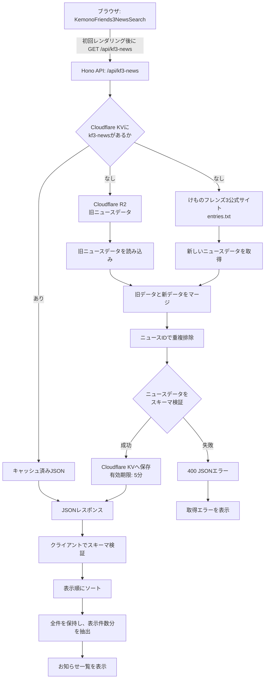

# けもフレ３おしらせ検索

けもフレ３のおしらせを検索することができるツールです。

## 作成した動機

けもフレ３公式サイトのおしらせの**重い**、**遅い**、**検索できない**、**昔のおしらせが辿れない**という課題を解決する目的で作成しました。

## 技術スタック

- [HonoX](https://github.com/honojs/honox)
- [Cloudflare Workers](https://workers.cloudflare.com/)
- [Cloudflare KV](https://developers.cloudflare.com/kv/)
- [Cloudflare R2](https://developers.cloudflare.com/r2/)

## ローカル開発

### 1. このリポジトリをクローン

```bash
git clone https://github.com/remkf/kf3-notification-search
```

```bash
cd ./kf3-notification-search
```

### 2. 依存関係をインストール

```bash
bun install
```

### 3. wranglerでCloudflareにログイン

```bash
wrangler login
```

### 4. Cloudflare KVの名前空間を作成

初回のみ実行します。すでに`KF3_NOTIF_CACHE`を作成済みの場合は、作成済みnamespaceの`id`を`wrangler.toml`へ設定します。

```bash
wrangler kv namespace create KF3_NOTIF_CACHE
```

```text
 ⛅️ wrangler 3.67.1
-------------------

🌀 Creating namespace with title "kv-worker-KF3_NOTIF_CACHE"
✨ Success!
Add the following to your configuration file in your kv_namespaces array:
[[kv_namespaces]]
binding = "KF3_NOTIF_CACHE"
id = "xxxxxxxxxxxxxxxxxxxxxxxxxxxxxxxxxxxxxxx"
```

上記の`id`を`wrangler.toml`の`id`に設定します。

### 5. Cloudflare R2を有効化してバケットを作成

Cloudflare DashboardでR2を有効化してから、初回のみバケットを作成します。すでに存在する場合は作成をスキップします。

```bash
wrangler r2 bucket create kf3-notif-data
```

旧ニュースデータをR2へアップロードします。JSONファイルはリポジトリに置かず、リポジトリ外のローカルファイルを指定してください。`--remote`を付けて、公開用のリモートR2へアップロードします。

```bash
wrangler r2 object put kf3-notif-data/entries_merged_20241107.json --file="D:/path/to/entries_merged_20241107.json" --content-type=application/json --remote
```

R2バケットは非公開のまま使用し、Workerの次のURLから配信します。

```text
https://kf3notif.<アカウントのサブドメイン>.workers.dev/entries_merged_20241107.json
```

### 6. 開発環境で実行

```bash
bun run dev
```

Workerの実行環境で確認する場合は、次のコマンドを使用します。

```bash
bun run preview
```

`bun run preview`のR2はローカル環境です。APIで旧ニュースデータを使用する場合は、公開用とは別に`--remote`なしでJSONをローカルR2へアップロードしてください。

### 7. デプロイ

```bash
bun run deploy
```

デプロイ後に表示される`https://kf3notif.<アカウントのサブドメイン>.workers.dev/`を利用します。カスタムドメインの設定は不要です。

### 8. テスト

```bash
bun run test
```

## お知らせ一覧取得フロー

画面の初回レンダリング後、クライアントがAPIからお知らせ一覧を取得します。APIはKVキャッシュを確認し、キャッシュがない場合だけR2の旧データと公式サイトの新しいデータを統合します。


