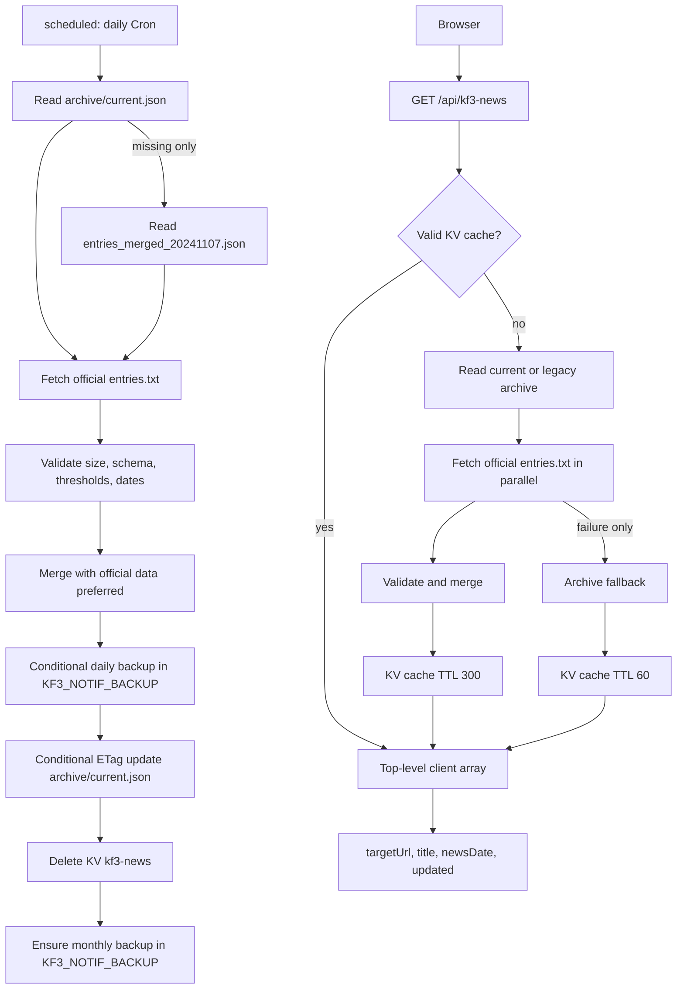

# けもフレ３おしらせ検索

けもフレ３のおしらせを検索することができるツールです。

## 作成した動機

けもフレ３公式サイトのおしらせの**重い**、**遅い**、**検索できない**、**昔のおしらせが辿れない**という課題を解決する目的で作成しました。

## 技術スタック

- [HonoX](https://github.com/honojs/honox)
- [Cloudflare Workers](https://workers.cloudflare.com/)
- [Cloudflare KV](https://developers.cloudflare.com/kv/)
- [Cloudflare R2](https://developers.cloudflare.com/r2/)

## ローカル開発

### リポジトリをクローン

```bash
git clone https://github.com/remkf/kf3-notification-search
```

```bash
cd ./kf3-notification-search
```

### 依存関係をインストール

```bash
bun install
```

### 3. wranglerでCloudflareにログイン

```bash
bunx wrangler login
```

### 3. KVとR2を準備する

KV namespaceを初回だけ作成し、表示されたIDを`wrangler.toml`の`KF3_NOTIF_CACHE`へ設定します。既存namespaceを使う場合は作成を省略します。

```bash
bunx wrangler kv namespace create KF3_NOTIF_CACHE
```

本番データ用R2バケットを作成します。既存の場合は作成を省略します。

```bash
bunx wrangler r2 bucket create kf3-notif-data
```

バックアップ用R2バケットと保持設定を作成します。これらのコマンドを実行する前に、対象アカウントとバケット名を確認します。

```bash
bunx wrangler r2 bucket create kf3-notif-backup
bunx wrangler r2 bucket lifecycle add kf3-notif-backup daily-90d daily/ --expire-days 90
bunx wrangler r2 bucket lock add kf3-notif-backup daily-30d daily/ --retention-days 30
bunx wrangler r2 bucket lock add kf3-notif-backup monthly-30d monthly/ --retention-days 30
bunx wrangler r2 bucket lifecycle list kf3-notif-backup
bunx wrangler r2 bucket lock list kf3-notif-backup
```

Lifecycleは`daily/`だけを90日後に削除します。`monthly/`にはexpire ruleを設定せず長期保持します。Bucket Lockは削除だけでなく上書きも防ぎ、適用後のobjectにも作用します。30日lockより短いexpire期間は設定しません。

既存データを初回移行する場合は、リポジトリ外のファイルを指定してdata bucketへアップロードします。既存の`entries_merged_20241107.json`は互換性のため残し、削除しません。

```bash
bunx wrangler r2 object put kf3-notif-data/entries_merged_20241107.json --file="D:/path/to/entries_merged_20241107.json" --content-type=application/json --remote
```

通常の累積アーカイブは`KF3_NOTIF_DATA/archive/current.json`です。これがない初回だけ`entries_merged_20241107.json`を読み込み、初回更新で`archive/current.json`を作成します。バックアップは`KF3_NOTIF_BACKUP/daily/YYYY/MM/DD/`と`KF3_NOTIF_BACKUP/monthly/YYYY-MM.json`へ保存します。

### 4. ローカルで実行する

通常の開発画面は次で起動します。

```bash
bun run dev
```

Worker、ローカルR2、scheduled handlerを確認する場合は次を起動します。

```bash
bun run preview
```

`bun run preview`のR2はローカルストレージです。本番bucketへ接続する`--remote`操作をローカル確認で使用しません。

### 5. scheduled handlerをローカルで確認する

`bun run preview`を起動した状態で、03:15 JSTに相当するUTC時刻を指定します。

```bash
curl "http://localhost:8787/cdn-cgi/handler/scheduled?format=json&cron=15+18+*+*+*&time=1785608100000"
```

固定時刻`1785608100000`は`2026-08-01T18:15:00Z`、JSTでは`2026-08-02 03:15:00`です。実装済みWranglerが`/__scheduled` routeを表示する場合は、そのrouteへ読み替えます。

確認項目は次のとおりです。

- responseの`outcome`が`ok`である。
- local R2に`archive/current.json`、`daily/2026/08/02/...json`、`monthly/2026-08.json`が作成される。
- 内容変更がない2回目はdailyとcurrentが増えず、monthlyは既存扱いになる。
- local testがproduction bucketを変更していない。

### 6. テストとデプロイ

本番Workerにはニュースアーカイブのコードが反映済みで、`15 18 * * *`のCron Triggerを1本登録済みです。追加のCronは作成せず、初回scheduled実行後にCPU時間と運用状態を確認します。詳細は [ニュースアーカイブ導入状態](./docs/news-archive-rollout.md) を参照してください。

```bash
bun run test
bun run lint
bun run format:check
bunx tsc --noEmit
bun run build
```

全ゲートとローカルscheduled確認が成功し、導入状態ドキュメントの保留事項を解消した後にデプロイします。

Healthchecks.ioのHobbyist planで`kf3notif-daily-archive` checkを作成し、Cron scheduleを`15 18 * * *`、timezoneをUTC、grace timeを30分に設定します。メンテナーのメール通知を有効にした後、check固有のping URLを対話入力でWorker secretへ保存します。URL自体をshell履歴、log、Gitへ残しません。

```bash
bunx wrangler secret put HEALTHCHECKS_PING_URL
```

```bash
bun run deploy
```

デプロイ後はWorkerのURLで`GET /api/kf3-news`を確認します。

## お知らせ一覧取得フロー

Cronの更新は保存用検証、統合、決定的ソートを使用します。APIのcache missは同じ検証と統合を使用しますが、ソートせず入力順を維持します。



APIの成功レスポンスは従来どおり`id`、`category`、未知フィールドを含まないトップレベル配列です。KV cacheが存在する場合は再検証せず、外部I/Oなしで返します。公式取得、公式検証、統合が失敗した場合は、正常なarchiveが読めたときだけarchiveをTTL 60秒で返します。archive自体が欠落または不正な場合は5xxを返し、公式データだけを返しません。通常の成功時はTTL 300秒です。

既存の`/entries_merged_20241107.json` GET/HEAD routeは互換性のため残します。通常のAPI取得先は`archive/current.json`またはlegacy fallbackです。

## 公式データの閾値と障害調査

| 定数                               |             現在値 | 意味                                    |
| ---------------------------------- | -----------------: | --------------------------------------- |
| `MAX_OFFICIAL_RESPONSE_BYTES`      | `10 * 1024 * 1024` | 公式レスポンス本文の最大byte数          |
| `OFFICIAL_FETCH_TIMEOUT_MS`        |           `10_000` | 公式レスポンス取得のタイムアウトms      |
| `MIN_OFFICIAL_ENTRY_COUNT`         |             `1900` | 公式データの最小件数                    |
| `MAX_UPDATED_EXISTING_ENTRY_COUNT` |              `100` | 1回の更新で変更を許可する既存IDの最大数 |

scheduled handlerは開始時にHealthchecks.ioへstart、正常終了時にsuccess、失敗時にfailを送ります。`kf3notif-daily-archive` checkがCron失敗と欠落を検知し、メンテナーへメール通知します。heartbeat送信自体の失敗ではarchive更新を中断せず、`event: news_archive_heartbeat_failed`と`stage`を秘密値なしでWorkers Logsへ記録します。

異常を調査するときはWorkers Logsの`stage`、`event`、`thresholdName`、設定値、実測値を確認します。公式本文や`HEALTHCHECKS_PING_URL`はlogへ記録しません。Healthchecks.ioは失敗と欠落の通知、Workers Logsは原因調査に使用します。

仕様変更で閾値を変える場合は、次の順で確認します。

1. 公式responseの件数、byte数、ID一意性、URL、日付、既存ID変更数を手動確認する。
2. 変更が公式仕様によるものか、部分取得や改ざんではないか確認する。
3. 定数と該当unit testを同じcommitで更新する。
4. 全検証gateとlocal scheduled testを通す。
5. deploy後にstructured logを確認する。

## 条件付き復元runbook

復元は`wrangler.restore.toml`のoperator-only Workerをlocalhostで起動し、remote bindingから本番R2とKVへ接続します。このWorkerをdeployしたり、公開routeを追加したりしません。remote bindingは本番resourceを直接操作できるため、対象account、bucket、snapshot keyを表示してメンテナー本人が確認してから起動します。

1. `daily/YYYY/MM/DD/...json`または`monthly/YYYY-MM.json`から、保存日時と目的の状態に合うsnapshot keyを選ぶ。
2. `bunx wrangler whoami`で対象accountを確認する。
3. 次のコマンドでlocalhost専用Workerを起動する。

```bash
bun run restore:dev
```

4. 別terminalからsnapshot keyだけを指定してdry-runする。`mode`を省略した場合もdry-runです。

```bash
curl -X POST "http://127.0.0.1:8790/restore" \
  -H "content-type: application/json" \
  --data '{"snapshotKey":"daily/YYYY/MM/DD/<snapshot>.json"}'
```

5. responseのsnapshot digest、件数、最古日、最新日、current ETag、予定操作を確認する。dry-runの`writes`が`{"r2Puts":0,"kvDeletes":0}`であることを確認する。
6. 実障害で復元が必要な場合だけ、最新dry-runに表示されたsnapshot digestとcurrent ETagをそのまま再入力してapplyする。

```bash
curl -X POST "http://127.0.0.1:8790/restore" \
  -H "content-type: application/json" \
  --data '{"mode":"apply","snapshotKey":"daily/YYYY/MM/DD/<snapshot>.json","snapshotDigest":"<dry-run digest>","currentEtag":"<dry-run etag>"}'
```

7. applyは保存用schema、全日付、ID一意性、正規化JSON、SHA-256を再検証し、`onlyIf.etagMatches`付きで`archive/current.json`を更新する。条件不一致または`put()`が`null`の場合は無条件上書きせず、最新dry-runからやり直す。
8. current更新成功後だけKVの`kf3-news`が削除される。responseの更新後ETagを確認する。
9. APIがトップレベル配列を返すこと、件数、最古日、最新日、snapshot digestが一致することを確認する。
10. R2から復元できない場合だけ、対象とrollback versionを再確認してlegacy objectを読む緊急code rollbackを行う。legacy objectは削除しない。

復元後はcurrentのETag、KV削除結果、API確認結果、snapshot digestを運用記録へ残します。
