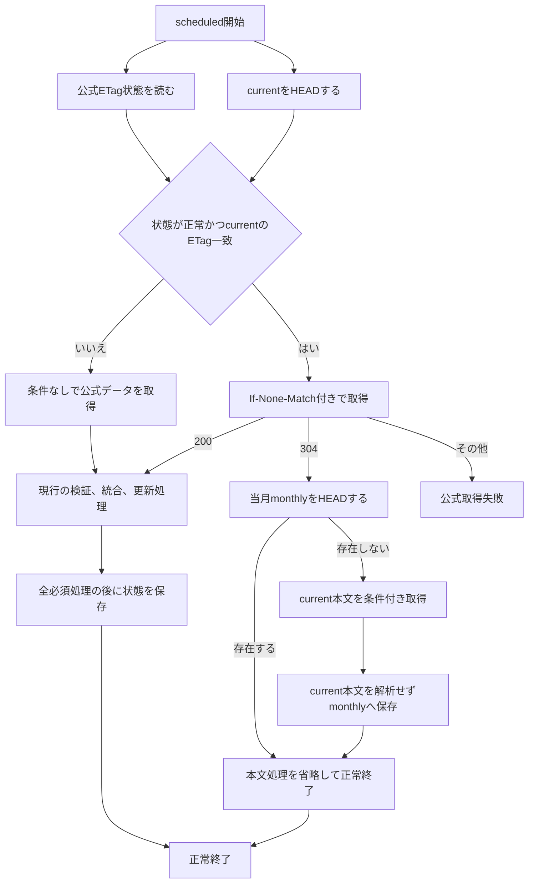

# ニュースアーカイブETag条件付き取得案

## 状態

本書は、日次scheduled処理とページリクエストのKV cache missで公式ETagを利用する実装仕様である。コードへの反映は完了しているが、本番Workerでの304応答、CPU時間、304率の受け入れ確認は未完了であり、運用状態は [ニュースアーカイブ導入状態](./news-archive-rollout.md) を参照する。

## 目的

公式配信元のETagと`If-None-Match`を利用し、公式データが前回の正常処理から変わっていない場合に、scheduled処理とページリクエストのKV cache missで本文処理を省略する。KV cache hitは従来どおり外部I/Oを行わない。

304経路では次を行わない。

- 公式レスポンス本文の読み込みとUTF-8デコード
- 公式JSONの解析と検証
- `archive/current.json`本文の読み込み、JSON解析、検証
- 累積アーカイブと公式データのID統合とdeep equality比較
- 統合結果のソートとJSONシリアライズ

Cron Triggerの頻度、日次バックアップと月次バックアップの意味、`archive/current.json`の更新条件は変更しない。

## 調査結果

公式配信元`https://kemono-friends-3.jp/info/all/entries.txt`は、通常のGETで強いETagと`Last-Modified`を返す。同じETagを`If-None-Match`へ指定したGETではHTTP 304、本文0 bytes、同じETagを返すことを確認した。

`fetchOfficialNews`は、条件付き取得のHTTP 304を`Response.ok`による判定に依存せず、本文を読み込まない`not-modified`結果として明示的に処理する。これにより、304時のJSON解析やアーカイブ統合を省略できる。

本番legacyデータと調査時点の公式データから現行ロジックで累積アーカイブを構成し、変更なし経路のJSON解析、検証、統合をローカルBunで100回計測した参考値は次のとおりだった。この値はWorkers本番CPU時間を示すものではなく、R2本文と公式本文のデコード、ログ、heartbeat、ランタイム差を含まない。

| 項目                 | 値                       |
| -------------------- | ------------------------ |
| 累積アーカイブ       | 5,598件、1,472,151 bytes |
| 公式データ           | 2,000件、631,395 bytes   |
| 変更なし処理の中央値 | 4.11ms                   |
| 変更なし処理のp95    | 6.32ms                   |
| 変更なし処理の最大値 | 8.04ms                   |

公式データが変更された日の200経路は現行と同等の処理を必要とする。したがって、全体の効果は304となる日の割合に依存し、導入後のログから評価する。

## 設計方針

公式ETagは単独で信用しない。次の2値を対にした状態をR2へ保存する。

- 正常に検証して処理した公式レスポンスのETag
- その公式レスポンスを反映済み、または統合結果が同一であると確認済みの`archive/current.json`のR2のETag

日次処理の開始時に、保存済みの`current`のETagと実際の`current`のETagが一致する場合だけ条件付きGETを行う。これにより、復元、手動操作、別実行によってcurrentが変わった後に、古い公式ETagを使って処理を省略することを防ぐ。

状態は正しさの根拠ではなく最適化用のヒントとして扱う。状態が欠落、不正、競合、またはcurrentと不一致の場合は、エラーで停止せず条件なしの完全処理へ切り替える。

## 状態オブジェクト

状態は本番データ用R2の次のキーへ保存する。

```text
KF3_NOTIF_DATA/archive/official-fetch-state.json
```

形式は次のとおりとする。

```json
{
  "version": 1,
  "officialEtag": "\"source-etag\"",
  "currentEtag": "r2-current-etag"
}
```

各フィールドの条件は次のとおり。

| フィールド     | 条件                                                                                                                                            |
| -------------- | ----------------------------------------------------------------------------------------------------------------------------------------------- |
| `version`      | 整数`1`                                                                                                                                         |
| `officialEtag` | 公式レスポンスから取得したRFC準拠の単一entity-tagである強いETag。空のopaque-tagを含む。引用符を含むヘッダー値を保存し、長さは1024文字以下とする |
| `currentEtag`  | 検証済み`archive/current.json`の引用符を含まないR2のETag                                                                                        |

ETagが欠落している場合、弱いETagである場合、長さや文字がヘッダー値として不正な場合は状態を更新せず、次回も完全処理を行う。

状態の保存先にはWorkers KVを使用しない。KVは結果整合性であり、本処理はcurrentとの対応関係を確認する必要がある。R2の`head()`、強整合な読み書き、ETag条件付きPUTを使用する。

`archive/current.json`のcustom metadataへ公式ETagを保存する方法も採用しない。公式のバイト列だけが変わり統合結果が同じ場合に、metadata更新のためだけにcurrentを上書きする必要が生じるためである。

## 処理フロー



### 条件付き取得の利用条件

次をすべて満たす場合だけ`If-None-Match`を送る。

1. `archive/current.json`が存在する。
2. 状態オブジェクトがJSONとして解析でき、保存形式を満たす。
3. 状態の`currentEtag`が`head()`で取得した`current`のETagと一致する。
4. 状態の`officialEtag`が利用可能な強いETagである。

currentが存在せずlegacyデータを使用する初回移行では、必ず条件なしの完全処理を行う。

### 304経路

304を受け取った場合、保存済み状態によって公式データとcurrentの双方が前回の検証済み状態から変わっていないと判断する。currentと公式の本文は取得または解析しない。

月次バックアップの補完を維持するため、当月の`monthly/YYYY-MM.json`を`head()`する。存在する場合はR2とKVを変更せず正常終了する。存在しない場合は次の順で作成する。

1. 状態の`currentEtag`を条件に`archive/current.json`を取得する。
2. 条件不一致の場合は月次バックアップを作成せず、公式データを条件なしで再取得して完全処理へ切り替える。
3. current本文の`ReadableStream`をJSON解析せず、当月monthlyへ条件付きで新規作成する。
4. monthlyキーが競合した場合は現行仕様と同じく保存済みとして扱う。

### APIのKV cache miss経路

APIのKV cache hitでは、従来どおりR2と公式サーバーへアクセスしない。cache missではstateの読み込みとcurrentの`head()`を並行して行い、stateの`currentEtag`と現在のcurrent R2 ETagが一致した場合だけ公式ETagを`If-None-Match`へ指定する。公式ETagとR2 ETagを相互比較しない。

APIが304を受け取った場合は公式本文を読み込まず、currentを同じR2 ETagの条件付きGETで取得する。取得したcurrent本文だけを保存用スキーマで検証してクライアント用配列へ投影し、通常の統合結果と同じTTL 300秒でKVへ保存する。currentの条件付き取得が競合した場合は古い本文を返さず、公式を条件なしで再取得して通常の統合へ戻る。APIはstateを更新しない。

### 200経路

200の場合は、現在の公式取得、検証、統合、日次バックアップ、current更新、KV削除、月次バックアップを維持する。

公式ETag状態は次のすべてが完了した後で更新する。

1. 公式レスポンスの取得と検証
2. 既存アーカイブとの統合
3. 変更がある場合の日次バックアップとcurrent更新
4. 変更がある場合のKV削除
5. 当月monthlyの作成または存在確認

統合結果に変更がない場合も、公式レスポンスのETagと読み込み済み`current`のETagを状態へ保存する。公式のキー順や未知フィールド表現だけが変わり、統合結果が同一だった場合も、次回から新しいETagで条件付き取得できるようにする。

状態PUTには、読み込み時の状態オブジェクトETagを使用する。状態が未作成の場合は存在しないことを条件にする。競合または保存失敗はアーカイブの正しさへ影響しないため、秘密値を含まない警告ログを残し、次回の完全処理へ委ねる。

## 失敗時の扱い

| 状況                                 | 扱い                                                                      |
| ------------------------------------ | ------------------------------------------------------------------------- |
| 状態が欠落または不正                 | 条件なしの完全処理へ切り替える                                            |
| `current`のETagが状態と不一致        | 条件なしの完全処理へ切り替える                                            |
| 公式レスポンスに強いETagがない       | 200本文を通常処理し、最適化状態は更新しない                               |
| 条件付きGETが304                     | 公式本文とcurrent本文の処理を省略し、monthlyだけ確認する                  |
| 条件付きGETが200                     | 現行の完全処理を行う                                                      |
| 条件付きGETが304と200以外            | 現行の公式取得失敗としてR2とKVを変更しない                                |
| current更新前に処理が失敗            | 状態を更新しない                                                          |
| current更新後にKVまたはmonthlyが失敗 | 状態を更新しない。次回は完全処理または`current`のETag不一致から再確認する |
| 状態の保存が失敗または競合           | currentを巻き戻さず警告し、次回の完全処理へ委ねる                         |

状態をcurrent更新より先に保存してはならない。先に保存すると、currentへ反映されなかった公式ETagに対して翌日の取得が304となり、未反映の変更を省略する可能性がある。

## 復元との整合性

復元applyによって`archive/current.json`が置換されるとR2のETagが変わる。保存済み状態の`currentEtag`とは一致しなくなるため、次回scheduled処理は条件付き取得を使用せず、公式データを完全取得して復元後のcurrentと再統合する。

復元処理で状態オブジェクトを削除することは必須としない。明示的に削除する場合も、current更新成功後に行い、削除失敗によって復元済みcurrentを巻き戻さない。

## ログと計測

更新成功ログへ次を追加する。ETag値自体は、調査に不要なため通常ログへ出力しない。

| フィールド                | 値                                                |
| ------------------------- | ------------------------------------------------- |
| `officialFetchStatus`     | `modified`または`not-modified`                    |
| `conditionalRequestUsed`  | 条件付きGETを送ったか                             |
| `currentEtagMatchedState` | 状態と`current`のETagが一致したか                 |
| `officialBodyProcessed`   | 公式本文を読み込み、解析したか                    |
| `monthlyBackupStatus`     | `created`、`existing`、または`not-checked`        |
| `etagStateStatus`         | `saved`、`unchanged`、`unavailable`、`conflicted` |

Workers Invocation LogsのCPU時間を`officialFetchStatus`別に集計する。導入前後の比較では経過時間ではなくCPU時間を使用する。

## テスト方針

既存の`app/__tests__/news-archive.test.ts`と`app/__tests__/server.test.ts`へ次を追加する。

- 状態と`current`のETagが一致すると`If-None-Match`が送られる。
- 304では公式本文とcurrent本文を読み込まず、統合、日次保存、current PUT、KV削除を行わない。
- 304でも当月monthlyが欠けていればcurrentの元バイト列から作成する。
- 304のmonthly作成中に`current`のETagが変わった場合は、古い本文を保存しない。
- 状態欠落、不正、`current`のETag不一致では条件なしGETを行う。
- 200で変更がある場合は、状態PUTが日次、current、KV、monthlyより後になる。
- 200で変更がない場合も、新しい公式ETagと現在の`current`のETagを保存する。
- current PUT、KV削除、monthly PUTの失敗時は状態を更新しない。
- 状態PUTの失敗または競合で、確定済みcurrentを巻き戻さない。
- 304を公式取得エラーとして扱わない。
- APIのKV cache hitではstate、R2、公式サーバーへアクセスしない。
- APIのKV cache missで304を受けた場合はcurrentを条件付きで読み、クライアント用配列へ投影する。
- APIの304後にcurrentが競合した場合は古い本文を返さず、条件なしの完全統合へ戻る。
- 公式ETagが欠落または弱い場合は状態を更新しない。
- 復元後を模した`current`のETag不一致では完全処理へ戻る。

## 受け入れ条件

- 公式配信元が本番Workerからの`If-None-Match`付きGETに304を返すことを確認できる。
- 304かつmonthly存在時に、公式本文とcurrent本文の読み込み、JSON解析、検証、統合、シリアライズを行わない。
- 304経路でも月次バックアップの欠落を補完できる。
- 200経路の安全性検証、日次バックアップ、ETag条件付きcurrent更新、KV削除、月次バックアップの順序を維持する。
- 状態とcurrentの不一致時に、公式変更を取り逃がさず完全処理へ戻る。
- 復元apply後の次回実行が完全処理になる。
- 304と200を区別したCPU時間をWorkers Invocation Logsで確認できる。
- 本番相当データで304経路がWorkers FreeのCPU上限10ms以内に収まる。
- 304率を少なくとも14日間記録し、最適化の実効性を評価できる。

## 実装対象

主な変更対象は次のとおり。

- `app/news-archive.ts`: 公式取得結果の200、304分岐、状態の読み書き、current HEAD、scheduled 304経路
- `app/server.ts`: API cache missの条件付き取得、304時のcurrent投影、fallback
- `app/__tests__/news-archive.test.ts`: 状態、条件付き取得、処理順、失敗経路のテスト
- `app/__tests__/server.test.ts`: APIのKV hit/miss、304、競合、fallback、scheduled/heartbeatの回帰テスト
- `docs/news-archive-spec.md`: 実装完了後に確定仕様を反映
- `docs/news-archive-rollout.md`: 本番受け入れ状態とCPU計測結果を反映

新しいpackageやCron Triggerは追加しない。
