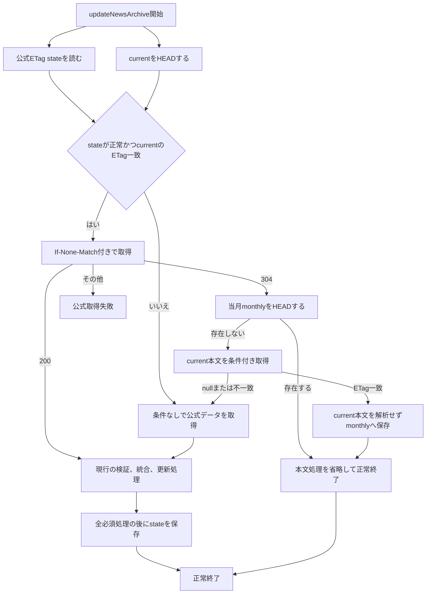

# お知らせアーカイブETag条件付き取得の実装仕様

## 状態

本書は、Queue consumerとscheduled fallbackが実行する`updateNewsArchive`、および表示用refreshで公式ETagを利用する現行実装の仕様を示す。表示用APIの`GET /api/kf3-news`は公式取得やETag条件付き取得を行わず、KV snapshotまたはR2 snapshotを返す。`POST /api/kf3-news/refresh`は保存済みstateとcurrent ETagが対応する場合だけ条件付き取得を利用するが、公式ETag stateを書き換えず、Queue consumerとscheduled fallbackの最適化状態へ影響を与えない。公式レスポンスのデータ形式とHTTP ETagの契約は [公式お知らせ配信仕様](./official-news-spec.md) を参照する。

## 目的

公式配信元のETagと`If-None-Match`をQueue consumerとscheduled fallbackの`updateNewsArchive`で利用し、公式データが前回の正常処理から変わっていない場合に本文処理を省略する。表示用データのrefreshは、表示用KVを最新化する独立した処理として公式データを取得、検証、mergeする。公式が304を返し、表示用KV v2の`baseArchiveEtag`がcurrent ETagと一致する場合は、KVのclient JSONを再利用してR2 current本文の読み込みと再投影を省略する。refreshの実行結果は公式ETag stateや`archive/current.json`の正しさの根拠にならず、merge差分がある場合またはcurrentが未作成の場合はQueue publishだけを行う。

Queue consumerまたはscheduled fallbackの304経路では次を行わない。

- 公式レスポンス本文の読み込みとUTF-8デコード
- 公式JSONの解析と検証
- `archive/current.json`本文の読み込み、JSON解析、検証
- 累積archiveと公式データのID統合とdeep equality比較
- 統合結果のソートとJSONシリアライズ
- 日次backup、current更新、KV削除

表示用GETの両KV missでは公式取得を行わず、R2 snapshotを投影する。投影したJSONをGET専用KV `kf3-news-archive-snapshot`へTTL付きでbest-effort保存し、同じ本文を直接返す。merged結果用KVを最優先し、GET専用KVの保存がmerged結果用KVを上書きすることはない。GETのKV hitではKVだけを読み、外部I/Oを行わない。refreshは表示用KVとrefresh制御metadataだけを更新し、ETag state、current、daily、monthlyを更新しない。merge差分がある場合またはcurrentが未作成の場合のQueue publishは表示用refreshの委譲であり、ETag stateや永続archiveの書き込みではない。

### refreshの304 fast path

1. refreshは保存済みstateとcurrent HEADのETagが対応する場合だけ公式へ`If-None-Match`を送る。
2. 公式が304を返したら、表示用KV `kf3-news`をmetadata付きで読む。
3. metadataがv2で、`baseArchiveEtag`が現在のcurrent ETagと一致し、valueが存在する場合はvalueをclient JSONとして再利用する。変更を含むmerge結果やcurrent未作成の結果は`baseArchiveEtag`が`null`となるため再利用しない。
4. 一致しない場合、v1、metadata欠落、value欠落の場合は`readCurrentArchiveDocumentIfEtag`へfallbackし、従来どおりR2本文を検証して投影する。
5. 再利用したJSONも通常のrefresh finalizationでTTL 300秒、`fetchedAt`、`newsCount`を更新保存する。HTTP本文は同じJSONを`{news, metadata}`へ埋め込む。

## 設計方針

公式ETagは単独で信用しない。次の2値を対にした状態をR2へ保存する。

- 正常に検証して処理した公式レスポンスのETag
- その公式レスポンスを反映済み、または統合結果が同一であると確認済みの`archive/current.json`のR2のETag

Queue consumerまたはscheduled fallbackの`updateNewsArchive`開始時に、保存済みのcurrentのETagと実際のcurrentのETagが一致する場合だけ条件付きGETを行う。これにより、復元、手動操作、別実行によってcurrentが変わった後に、古い公式ETagを使って処理を省略することを防ぐ。

stateは正しさの根拠ではなく最適化用のヒントとして扱う。stateが欠落、不正、競合、またはcurrentと不一致の場合は、エラーで停止せず条件なしの完全処理へ切り替える。refreshも同じ対応関係を条件付き取得の判定に利用するが、stateは書き換えない。refreshの実行後もQueue consumerとscheduled fallbackは保存済みstateとcurrent ETagの対応を検証する。重複Queue messageもこのETag/CAS/304境界で処理し、無条件上書きを行わない。

## 状態object

状態は本番データ用R2の次のkeyへ保存する。

```text
KF3_NOTIF_DATA/archive/official-fetch-state.json
```

形式は次のとおりとする。

```json
{
  "version": 1,
  "officialEtag": "\"source-etag\"",
  "currentEtag": "r2-current-etag"
}
```

各フィールドの条件は次のとおり。

| フィールド     | 条件                                                                                                                                            |
| -------------- | ----------------------------------------------------------------------------------------------------------------------------------------------- |
| `version`      | 整数`1`                                                                                                                                         |
| `officialEtag` | 公式レスポンスから取得したRFC準拠の単一entity-tagである強いETag。空のopaque-tagを含む。引用符を含むヘッダー値を保存し、長さは1024文字以下とする |
| `currentEtag`  | 検証済み`archive/current.json`の引用符を含まないR2のETag                                                                                        |

ETagが欠落している場合、弱いETagである場合、長さや文字がヘッダー値として不正な場合はstateを更新せず、次回も完全処理を行う。

stateの保存先にはWorkers KVを使用しない。KVは結果整合性であり、本処理はcurrentとの対応関係を確認する必要がある。R2の`head()`、強整合な読み書き、ETag条件付きPUTを使用する。

`archive/current.json`のcustom metadataへ公式ETagを保存する方法も採用しない。公式のバイト列だけが変わり統合結果が同じ場合に、metadata更新のためだけにcurrentを上書きする必要が生じるためである。

## 処理フロー



### 条件付き取得の利用条件

次をすべて満たす場合だけ`If-None-Match`を送る。

1. `archive/current.json`が存在する。
2. state objectがJSONとして解析でき、保存形式を満たす。
3. stateの`currentEtag`が`head()`で取得したcurrentのETagと一致する。
4. stateの`officialEtag`が利用可能な強いETagである。

currentが存在せずlegacyデータを使用する初回移行では、必ず条件なしの完全処理を行う。

### 304経路

304を受け取った場合、保存済みstateによって公式データとcurrentの双方が前回の検証済み状態から変わっていないと判断する。currentと公式の本文は取得または解析しない。

月次backupの補完を維持するため、当月の`monthly/YYYY-MM.json`を`head()`する。存在する場合はR2とKVを変更せず正常終了する。存在しない場合は次の順で作成する。

1. stateの`currentEtag`を条件に`archive/current.json`を取得する。
2. 条件不一致の場合は月次backupを作成せず、公式データを条件なしで再取得して完全処理へ切り替える。
3. current本文の`ReadableStream`をJSON解析せず、当月monthlyへ条件付きで新規作成する。
4. monthly keyが競合した場合は保存済みとして扱う。

### 200経路

200の場合は公式取得、検証、archiveとの統合、必要な日次backup、current更新、月次backupを行う。scheduled fallbackではcurrent更新後にKVも削除し、Queue consumerではrefresh由来のKVを維持する。公式ETag stateは次のすべてが完了した後で更新する。

1. 公式レスポンスの取得と検証
2. 既存archiveとの統合
3. 変更がある場合の日次backupとcurrent更新
4. 表示KV invalidationが有効な場合のKV削除
5. 当月monthlyの作成または存在確認

統合結果に変更がない場合も、公式レスポンスのETagと読み込み済みcurrentのETagをstateへ保存する。公式のキー順や未知フィールド表現だけが変わり、統合結果が同一だった場合も、次回から新しいETagで条件付き取得できるようにする。

state PUTには、読み込み時のstate object ETagを使用する。stateが未作成の場合は存在しないことを条件にする。競合または保存失敗はarchiveの正しさへ影響しないため、archiveを巻き戻さず、成功ログの`etagStateStatus`へ反映して次回の完全処理へ委ねる。state保存専用のwarningログは出さない。

refresh成功後に公式ETag stateを保存してはならない。refreshは表示用KVと制御metadataだけを変更し、次回のQueue consumerまたはscheduled fallbackがstateとcurrentの対応を検証できる状態を維持する。

## 失敗時の扱い

| 状況                                 | 扱い                                                                     |
| ------------------------------------ | ------------------------------------------------------------------------ |
| stateが欠落または不正                | Queue consumerとscheduled fallbackは条件なしの完全処理へ切り替える       |
| currentのETagがstateと不一致         | Queue consumerとscheduled fallbackは条件なしの完全処理へ切り替える       |
| 公式レスポンスに強いETagがない       | 200本文を通常処理し、最適化stateは更新しない                             |
| 条件付きGETが304                     | 公式本文とcurrent本文の処理を省略し、monthlyだけ確認する                 |
| 条件付きGETが200                     | 現行の完全処理を行う                                                     |
| 条件付きGETが304と200以外            | 公式取得失敗としてR2とKVを変更しない                                     |
| current更新前に処理が失敗            | stateを更新しない                                                        |
| current更新後にKVまたはmonthlyが失敗 | stateを更新しない。次回は完全処理またはcurrentのETag不一致から再確認する |
| stateの保存が失敗または競合          | currentを巻き戻さず`etagStateStatus`へ記録し、次回の完全処理へ委ねる     |
| refreshの公式取得またはmergeが失敗   | 表示用KV、archive、ETag stateを変更せず503を返す                         |
| Queue送信だけが失敗                  | refreshのKV保存と200を維持し、Queue送信失敗をログへ記録する              |

stateをcurrent更新より先に保存してはならない。先に保存すると、currentへ反映されなかった公式ETagに対して翌日の取得が304となり、未反映の変更を省略する可能性がある。

## 復元との整合性

復元applyによって`archive/current.json`が置換されるとR2のETagが変わる。保存済みstateの`currentEtag`とは一致しなくなるため、次回のQueue consumerまたはscheduled fallbackは条件付き取得を使用せず、公式データを完全取得して復元後のcurrentと再統合する。

復元処理でstate objectを削除することは必須としない。明示的に削除する場合も、current更新成功後に行い、削除失敗によって復元済みcurrentを巻き戻さない。refresh制御metadataは復元の対象外とする。

## ログと計測

更新成功ログには次を含める。ETag値自体は、調査に不要なため通常ログへ出力しない。

| フィールド                | 値                                                |
| ------------------------- | ------------------------------------------------- |
| `officialFetchStatus`     | `modified`または`not-modified`                    |
| `conditionalRequestUsed`  | 条件付きGETを送ったか                             |
| `currentEtagMatchedState` | stateとcurrentのETagが一致したか                  |
| `officialBodyProcessed`   | 公式本文を読み込み、解析したか                    |
| `monthlyBackupStatus`     | `created`または`existing`                         |
| `etagStateStatus`         | `saved`、`unchanged`、`unavailable`、`conflicted` |

Workers Invocation LogsのCPU時間を`officialFetchStatus`と`trigger`別に集計する。導入前後の比較では経過時間ではなくCPU時間を使用する。refresh、Queue consumer、scheduled fallbackのCPU時間は別invocationとして集計する。

## テスト・受入の確認観点

実装の回帰テストと本番受入では、次の観点を確認対象とする。

- stateとcurrentのETagが一致するとQueue consumerまたはscheduled fallbackから`If-None-Match`が送られる。
- Queue consumerまたはscheduled fallbackの304では公式本文とcurrent本文を読み込まず、統合、日次保存、current PUT、KV削除を行わない。
- 304でも当月monthlyが欠けていればcurrentの元バイト列から作成する。
- 304のmonthly作成中にcurrentのETagが変わった場合は、古い本文を保存しない。
- state欠落、不正、currentのETag不一致では条件なしGETを行う。
- 200で変更がある場合は、state PUTが日次、current、必要なKV invalidation、monthlyより後になる。
- 200で変更がない場合も、新しい公式ETagと現在のcurrentのETagを保存する。
- current PUT、表示KV invalidationが有効な場合のKV削除、monthly PUTの失敗時はstateを更新しない。
- state PUTの失敗または競合で、確定済みcurrentを巻き戻さない。
- 304を公式取得エラーとして扱わない。
- GETのKV hitではR2、公式サーバー、stateへアクセスしない。
- GETのKV missでは公式サーバーへアクセスせず、R2 snapshotを投影して同じJSONを表示用KVへbest-effort保存する。
- refreshは公式取得、検証、merge、KV保存を行い、成功本文は`{news, metadata}`とするが、current、daily、monthly、公式ETag stateを変更しない。304かつKV v2/current ETag一致時は、KV JSONを再利用してR2 current本文を読まない。
- 別refreshの実行中は公式取得前に202、5分cooldown中は429を返す。
- refresh成功時は200と`{news, metadata}`を返す。
- refreshの依存処理失敗時は503を返し、表示用KVを置き換えない。
- refresh制御metadataのCAS競合で無条件上書きを行わない。
- 復元後を模したcurrentのETag不一致ではQueue consumerまたはscheduled fallbackが完全処理へ戻る。

## 受け入れ条件

- Queue consumerとscheduled fallbackの304経路で公式本文とcurrent本文の読み込み、JSON解析、検証、統合、シリアライズを行わない。
- Queue consumerまたはscheduled fallbackの304経路でも月次backupの欠落を補完できる。
- Queue consumerとscheduled fallbackの200経路で安全性検証、日次backup、ETag条件付きcurrent更新、月次backup、state保存の順序を維持する。scheduled fallbackではcurrent更新後にKVも削除し、Queue consumerではrefresh由来のKVを維持する。
- stateとcurrentの不一致時に、公式変更を取り逃がさず完全処理へ戻る。
- refreshが表示用KVだけを更新し、永続archiveと公式ETag stateへ影響を与えない。
- 別refreshの実行中とlease失効は202、cooldownは429、依存処理の失敗は503へ変換する。
- `GET /`のStatic Assets応答が公式サーバー、R2、KVへのお知らせ取得を開始せず、Workerを起動しない。
- GETのKV write-through後にcurrent ETagを再確認し、古いsnapshotを削除できる。writeまたは確認失敗でもHTTP 200を維持し、`news_api_cache_write_failed`を記録できる。
- 304かつKV v2/current ETag一致時にR2 current本文の読み込み、JSON解析、検証、再projection、再シリアライズを行わない。
- GET、refresh、Queue consumer、scheduled fallbackのCPU時間を別invocationとして確認できる。
- 復元apply後の次回Queue consumerまたはscheduled fallbackが完全処理になる。
- Queue consumer、scheduled fallback、refreshを別々にWorkers Invocation Logsで計測できる。

## 実装箇所と検証対象

主な実装箇所と関連文書は次のとおり。

- `app/news-archive.ts`: 公式取得結果の200、304分岐、stateの読み書き、current HEAD、scheduled 304経路
- `app/server.ts`: 表示用GET、refresh、Queue publish、Queue consumer、R2 leaseと制御metadata、KV投影
- `app/news-archive-queue.ts`: Queue messageの形式と検証
- `app/routes/index.tsx`: お知らせ取得を行わないSSG shell
- `app/islands/KemonoFriends3NewsSearch.tsx`: shell表示後のGET、refresh呼び出し
- `app/__tests__/news-archive.test.ts`: state、条件付き取得、scheduled処理順、失敗経路のテスト
- `app/__tests__/server.test.ts`: GETのKV hit/miss、refresh、Queue publish、Queue consumer、lease、cooldown、scheduled、heartbeatの回帰テスト
- `docs/news-spec.md`: 共通契約と仕様文書の入口
- `docs/official-news-spec.md`: 公式データとETagの契約
- `docs/news-archive-update-spec.md`: Queue consumerとscheduled fallbackの確定仕様
- `docs/news-page-request-spec.md`: ページ表示、GET、refreshの確定仕様
- `docs/news-archive-rollout.md`: 本番受け入れ状態と運用確認

本実装では新しいCron Triggerを追加しない。scheduled fallbackは既存の`15 18 * * *`を使用し、Queue consumerを追加のarchive更新経路として使用する。
