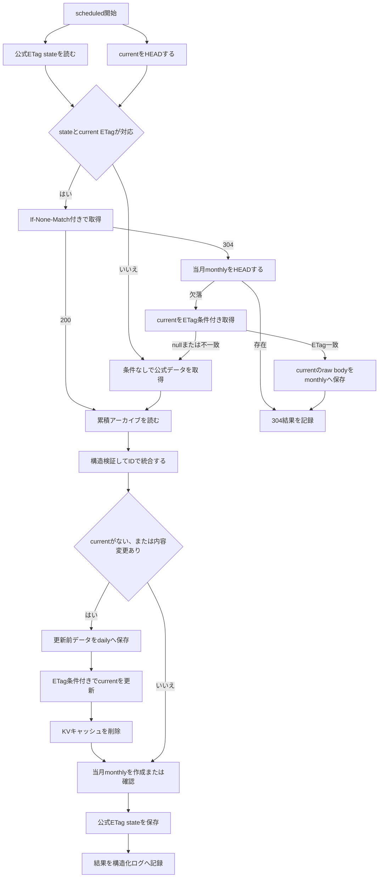

# ニュースアーカイブ定期実行更新仕様

## この文書の責務

本書は、Cronから呼び出されるscheduled handlerの仕様を定義する。定期実行は、公式データを検証して累積アーカイブの正しさを確定し、必要なバックアップを保存する唯一の通常更新経路である。

ユーザーの`GET /api/kf3-news`はcurrentを読み、cache miss時にKVへ表示用の結果を保存するだけであり、本書の更新処理を実行しない。共通の保存形式、R2とKVの役割、公式ETag stateの契約は [ニュース機能共通仕様](./news-spec.md)、ページリクエストの仕様は [ニュースページリクエスト仕様](./news-page-request-spec.md) を参照する。

## 実行時刻と更新対象

リポジトリ上のCron設定は`15 18 * * *`で、毎日18:15 UTC、JSTでは翌日03:15に実行する。バックアップの日付には実際の処理開始時刻ではなく`ScheduledController.scheduledTime`を使用する。本番Cronの登録状況は [ニュースアーカイブ導入状態](./news-archive-rollout.md) を参照する。

定期実行が更新または削除できる対象は次のとおりである。

- `KF3_NOTIF_DATA/archive/current.json`
- `KF3_NOTIF_DATA/archive/official-fetch-state.json`
- `KF3_NOTIF_BACKUP/daily/...`
- `KF3_NOTIF_BACKUP/monthly/...`
- current更新成功後のWorkers KV `kf3-news`の削除

公式データの取得または検証が失敗した場合は、R2とKVを変更せず処理全体を失敗させる。ユーザーリクエストのためのKV結果保存は、scheduled処理の更新成功条件には含めない。

## 処理フロー

## 更新処理

1. 公式ETag stateと`archive/current.json`のR2 ETagを並行して確認する。公式ETagとR2 ETagを比較するのではなく、stateに保存したcurrent ETagと現在のcurrent ETagが一致する場合だけ、stateの公式ETagを`If-None-Match`へ使用する。
2. 条件付き取得を使えない場合は、`archive/current.json`を読み、存在しない場合だけlegacyデータを読む。アーカイブ読み込みと公式取得は並行して行う。
3. 条件付き取得が200の場合は公式本文を検証した後にcurrentを読み、条件なし取得と同じ統合処理を行う。304の場合は公式本文とcurrent本文の解析、検証、統合、ソート、シリアライズ、daily保存、current更新、KV削除を省略する。
4. 304では当月monthlyを`head()`する。存在すればR2とKVを変更せず正常終了する。欠落していればcurrentをstateのETagで条件付き取得し、取得objectのETagが一致した場合だけraw bodyをJSON解析せずmonthlyへ保存する。条件不一致なら条件なしの完全処理へ戻る。
5. 200経路ではアーカイブと公式データの基本構造、必須フィールドの型、ID一意性を検証し、IDをキーに統合する。公式データの新規または変更項目だけURLと日時を厳密に検証する。同じIDには公式データを採用し、アーカイブにだけ存在するIDは残す。
6. 未知フィールドを含むJSON値のdeep equalityで既存項目と公式項目を比較し、追加件数または変更件数から内容変更の有無を判定する。オブジェクトのキー順だけの違いは変更扱いにしない。
7. 内容変更がある場合だけ、統合結果を`newsDate`の降順、同時刻の場合は`id`の降順で決定的にソートし、JSONを1回だけシリアライズする。オブジェクトのキーは再帰的に並べ替えず、SHA-256 digestも計算しない。
8. 内容変更がある場合、更新前のアーカイブの元のバイト列を`If-None-Match: *`の条件付きPUTで日次バックアップへ新規作成する。
9. 読み込み時のETagを条件に`archive/current.json`を更新する。初回作成時は、currentが存在しないことを条件にする。
10. current更新に成功した後でKVの`kf3-news`を削除する。
11. 当月の月次バックアップを条件付きで新規作成する。すでに存在する場合は内容を再取得しない。条件不一致の場合は既存として扱い、本文を取得しない。
12. 200経路ではmonthly完了後に、公式strong ETagと確定済みcurrentのR2 raw ETagをstateへCAS保存する。state保存の失敗・競合でarchiveを巻き戻さず、結果の`etagStateStatus`へ反映して処理結果を構造化ログへ記録する。state保存専用のwarningログは出さない。

currentがまだなく、legacyデータから移行する初回実行では、統合結果がlegacyと同じでも更新ありとして扱う。これにより、更新前legacyの日次バックアップと`archive/current.json`を作成する。

内容変更がない場合はソート、JSONシリアライズ、日次バックアップ、current更新、KV削除を省略する。ただし、当月の月次バックアップが欠けていれば、読み込み済みcurrentのバイト列から作成を試みる。

## 304経路

公式条件付きGETが304の場合、公式データとcurrentが前回の検証済み状態から変わっていないと判断する。次の処理を省略する。

- 公式レスポンス本文の読み込みとUTF-8デコード
- 公式JSONの解析と検証
- `archive/current.json`本文の読み込み、JSON解析、検証
- 累積アーカイブと公式データのID統合とdeep equality比較
- 統合結果のソートとJSONシリアライズ
- 日次バックアップ、current更新、KV削除

月次バックアップの補完のため、当月の`monthly/YYYY-MM.json`を`head()`する。存在する場合はR2とKVを変更せず正常終了する。存在しない場合は次の順で作成する。

1. stateの`currentEtag`を条件に`archive/current.json`を取得する。
2. 条件不一致の場合は月次バックアップを作成せず、公式データを条件なしで再取得して完全処理へ切り替える。
3. current本文の`ReadableStream`をJSON解析せず、当月monthlyへ条件付きで新規作成する。
4. monthlyキーが競合した場合は保存済みとして扱う。

## バックアップ仕様

### 日次バックアップ

- キーは`daily/YYYY/MM/DD/<UTC日時>.json`とする。
- `<UTC日時>`は`YYYY-MM-DDTHH-mm-ssZ`形式とし、ミリ秒を省略して時刻区切りのコロンをハイフンへ置き換える。例は`2026-08-01T18-15-00Z`とする。
- ディレクトリの日付はJST、ファイル名の日時はUTCとする。
- currentを変更する直前のアーカイブの元のバイト列を保存する。
- 内容変更がある場合、またはcurrentを初回作成する場合だけ作成する。
- `If-None-Match: *`で既存オブジェクトの上書きを防ぐ。同じキーがすでにある場合は重複実行または競合として失敗し、既存オブジェクトを読み直さない。

### 月次バックアップ

- キーは`monthly/YYYY-MM.json`とし、年月はJSTで判定する。
- 各月で最初に正常に到達した実行が、本番反映済みのアーカイブを保存する。
- 200または条件なしのfull経路では、同じ月のオブジェクトを上書きしないため、事前の`head()`や`get()`は行わず、毎回`If-None-Match: *`の条件付きPUTを1回だけ実行する。
- 304経路では先に当月monthlyを`head()`し、存在すればPUTしない。欠落時だけcurrentをstateのETagで条件付き取得し、ETag一致時のraw bodyをmonthlyへ保存する。条件付き取得が`null`または不一致ならfull経路へ戻る。
- full経路のPUTが`R2Object`を返した場合は新規作成、条件不一致で`null`を返した場合は保存済みとして扱い、既存本文は取得しない。304経路も条件付きPUTの`null`を保存済みとして扱う。
- currentの内容変更がない実行でも、月次バックアップが欠けていれば作成する。

日次および月次バックアップの内容は、復元dry-runまたは運用上の完全性監査で厳密に検証する。

運用上、`daily/`は90日後に削除するLifecycle Ruleを設定し、`daily/`と`monthly/`には30日間のBucket Lockを設定する。`monthly/`には期限削除を設定せず長期保持する。

## 公式データ検証の定期実行への適用

公式データの取得と統合には、[ニュース機能共通仕様](./news-spec.md) の公式データ利用時の安全性検証を適用する。200経路では、検証済みの既存IDで初期化したMapへ公式項目を追加または置換する。このアルゴリズムにより、統合後の件数が更新前より減らず、更新前のすべてのIDが残ることを保証し、統合後の全件再走査は行わない。

定期実行で公式取得または検証に失敗した場合は、current、バックアップ、公式ETag state、KVを変更せず処理全体を失敗させる。閾値を変更する場合は、実際の公式データが仕様変更されたことを確認し、定数とテストを同時に更新する。

## 同時実行と失敗時の扱い

- current更新には、読み込み時に取得したR2 ETagを使用する。
- currentが未作成の場合は、`If-None-Match: *`でオブジェクトが存在しないことを条件に作成する。
- 条件付き更新が競合した場合は失敗とし、無条件上書きや自動再試行は行わない。
- 日次バックアップの保存に失敗した場合は、currentとKVを変更しない。
- current更新が競合した場合は、KV削除と月次バックアップへ進まない。先に作成済みの日次バックアップは残す。
- KV削除に失敗した場合、current更新は巻き戻さず、月次バックアップの作成へも進まない。scheduled処理は失敗として終了し、既存キャッシュは有効期限によって解消される。月次バックアップが欠けている場合は、次回の正常実行で作成を再試行する。
- 月次バックアップの条件付きPUTが`null`を返した場合は、別実行が保存済みとして扱う。
- 月次バックアップの条件付きPUTが例外になった場合は失敗とし、current更新は巻き戻さない。次回の正常実行で月次バックアップ作成を再試行する。

公式取得または検証が失敗した場合は、current、バックアップ、公式ETag state、KVを変更しない。state保存が失敗または競合した場合だけは、確定済みcurrentを巻き戻さず、次回の完全処理へ委ねる。

## 監視とログ

`HEALTHCHECKS_PING_URL`が設定されている場合、scheduled handlerは次のheartbeatを送る。

| タイミング | 送信先             |
| ---------- | ------------------ |
| 更新開始前 | `<ping URL>/start` |
| 更新成功後 | `<ping URL>`       |
| 更新失敗後 | `<ping URL>/fail`  |

heartbeatはHTTP POSTで送信する。ping URLの末尾の`/`は取り除いてからsuffixを付け、2xx以外のレスポンスも送信失敗として扱う。heartbeatは10秒でタイムアウトする。heartbeat自体の失敗はアーカイブ更新を中断せず、秘密値を含まない`news_archive_heartbeat_failed`ログを残す。アーカイブ更新が失敗した場合はfail送信を試みた後、元のエラーを再送出してscheduled実行も失敗させる。

主な構造化ログイベントは次のとおり。

| イベント                        | 意味                                          |
| ------------------------------- | --------------------------------------------- |
| `news_archive_update`           | 日次更新が完了した                            |
| `news_archive_update_failed`    | 日次更新がいずれかの段階で失敗した            |
| `news_archive_heartbeat_failed` | heartbeat送信に失敗した                       |
| `news_api_fallback`             | APIが公式データを使えずアーカイブだけを返した |
| `news_api_error`                | APIがレスポンスを構築できなかった             |

更新成功ログには更新有無、実行時刻、各件数、公式レスポンスのバイト数、バックアップキー、`officialFetchStatus`、`conditionalRequestUsed`、`currentEtagMatchedState`、`officialBodyProcessed`、`monthlyBackupStatus`、`etagStateStatus`、処理時間を含める。公式ETagとR2 ETagの値自体はログへ出さない。処理時間は外部I/O待ちを含む経過時間であり、WorkersのCPU時間判定には使用しない。

失敗ログには処理段階とエラー詳細を含めるが、公式レスポンス本文やheartbeat URL、ETag値は含めない。汎用エラーの詳細には`originalError`としてnameとmessageだけを含める。制御文字と改行を空白へ正規化し、URL、Authorization、Bearer、一般的なtoken・secret・password形式、JWTと既知のtoken prefixをredactした後、nameを100文字、messageを500文字までに制限する。stack、cause、独自プロパティは含めず、非`Error`値は任意に文字列化せず固定値で記録する。

## 304とETag stateの保存順序

公式ETag stateは、次の処理がすべて完了した後に保存する。

1. 公式レスポンスの取得と検証
2. 既存アーカイブとの統合
3. 内容変更がある場合の日次バックアップとcurrent更新
4. 内容変更がある場合のKV削除
5. 当月monthlyの作成または存在確認

統合結果に変更がない場合も、公式レスポンスのETagと読み込み済みcurrentのETagをstateへ保存する。公式のキー順や未知フィールド表現だけが変わり、統合結果が同一だった場合も、次回から新しいETagで条件付き取得できるようにする。

state PUTには、読み込み時のstateオブジェクトETagを使用する。stateが未作成の場合は存在しないことを条件にする。競合または保存失敗はアーカイブの正しさへ影響しないため、archiveを巻き戻さず、成功ログの`etagStateStatus`へ反映して次回の完全処理へ委ねる。state保存専用のwarningログは出さない。

stateをcurrent更新より先に保存してはならない。先に保存すると、currentへ反映されなかった公式ETagに対して翌日の取得が304となり、未反映の変更を省略する可能性がある。

ETag条件付き取得の共通設計とAPI cache miss経路は [ニュースアーカイブETag条件付き取得の実装仕様](./news-archive-etag-optimization.md) を参照する。
