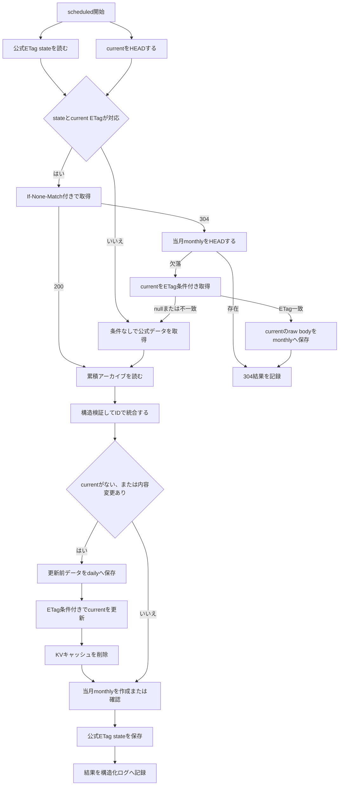

# ニュースアーカイブ機能仕様

## 概要

本機能は、けものフレンズ3公式サイトのお知らせを累積保存し、公式サイトから掲載終了したお知らせも検索できる状態を維持する。

日常の検索では累積アーカイブと最新の公式データを統合して返す。累積アーカイブ自体の更新は毎日のscheduled処理だけが行い、更新前のスナップショット、同時実行対策、異常データの検知を組み合わせて既存データの消失や意図しない上書きを防ぐ。

## 利用者から見た振る舞い

- `GET /api/kf3-news`は、過去に保存したお知らせと現在の公式お知らせを統合した一覧を返す。
- 公式サイトからお知らせが削除されても、累積アーカイブに保存済みの項目は一覧に残る。
- 同じIDのお知らせが公式側で更新された場合は、公式側の内容を優先する。
- 公式サイトを一時的に取得できない場合も、正常な累積アーカイブがあれば検索を継続できる。
- APIレスポンス形式はトップレベルのJSON配列とする。

```json
[
  {
    "targetUrl": "/info/detail/1234567890.html",
    "title": "お知らせのタイトル",
    "newsDate": "2026年08月02日 12時00分00秒",
    "updated": "",
    "category": "お知らせ"
  }
]
```

レスポンスには`targetUrl`、`title`、`newsDate`、`updated`を必須フィールドとして含め、保存用データに`category`がある場合だけ任意フィールドとして含める。`id`やその他の未知フィールドはクライアントへ返さない。`category`がない、空文字、空白だけの場合、UIは分類ラベルを表示しない。`category`はカンマで分割し、値ごとに異なる背景色のラベルとして表示する。`【サイト】アプリ`は`アプリ`として表示し、`【サイト】`は表示しない。

## 構成要素

| 種別           | 名前またはキー                                     | 役割                                                  |
| -------------- | -------------------------------------------------- | ----------------------------------------------------- |
| 公式データ     | `https://kemono-friends-3.jp/info/all/entries.txt` | 最新のお知らせを取得する入力元                        |
| 本番R2         | `KF3_NOTIF_DATA/archive/current.json`              | 通常使用する累積アーカイブ                            |
| 本番R2         | `KF3_NOTIF_DATA/archive/official-fetch-state.json` | 公式ETagとcurrent R2 ETagの対応状態                   |
| 本番R2         | `KF3_NOTIF_DATA/entries_merged_20241107.json`      | 初回移行と互換配信用のlegacyデータ                    |
| バックアップR2 | `KF3_NOTIF_BACKUP/daily/...`                       | 更新直前の累積アーカイブ                              |
| バックアップR2 | `KF3_NOTIF_BACKUP/monthly/...`                     | 各月最初の正常実行時点の本番反映済みアーカイブ        |
| Workers KV     | `KF3_NOTIF_CACHE`の`kf3-news`                      | APIレスポンスのキャッシュ                             |
| 監視           | `HEALTHCHECKS_PING_URL`                            | scheduled処理の開始、成功、失敗を通知する任意のsecret |

`archive/current.json`が存在しない場合だけlegacyデータを読み込む。`archive/current.json`が存在するもののJSONまたは内容が不正な場合はlegacyデータへフォールバックせず、異常として扱う。これにより、壊れたcurrentが見逃されることを防ぐ。

## 保存データの契約

累積アーカイブは次の形のJSONオブジェクトとする。

```json
{
  "news": [
    {
      "id": 1234567890,
      "targetUrl": "/info/detail/1234567890.html",
      "title": "お知らせのタイトル",
      "newsDate": "2026年08月02日 12時00分00秒",
      "updated": "",
      "category": "お知らせ"
    }
  ]
}
```

各項目は保存時と復元時に次の条件を満たす必要がある。通常のAPIとscheduled処理で保存済みアーカイブを読む際は、JSON構造、必須フィールドの型、正のID、ID一意性だけを検証し、全件の日付解析は繰り返さない。

| フィールド  | 条件                                               |
| ----------- | -------------------------------------------------- |
| `id`        | 正の整数。ドキュメント内で一意                     |
| `targetUrl` | 空でない文字列                                     |
| `title`     | 空でない文字列                                     |
| `newsDate`  | `yyyy年MM月dd日 HH時mm分ss秒`形式の実在するJST日時 |
| `updated`   | 文字列                                             |
| `category`  | 省略可能な文字列                                   |

公式サイト側の項目追加に追従できるよう、保存用データでは未知フィールドを保持する。

scheduled処理でcurrentを更新する場合は、項目を`newsDate`と`id`で決定的にソートし、JSONを1回だけシリアライズする。オブジェクトのキーは再帰的に並べ替えず、SHA-256 digestも計算しない。復元処理では、操作対象を厳密に確認するため、正規化JSONとSHA-256 digestを使用する。

## API取得仕様

`GET /api/kf3-news`は次の順で処理する。

1. KVの`kf3-news`を`getWithMetadata`で読み込む。
2. キャッシュが存在すれば、Worker自身が保存した値として本文を再解析せず、R2や公式サーバーへアクセスせずに返す。KV metadataはレスポンスヘッダーへ変換する。
3. キャッシュがなければ、公式ETag stateと`archive/current.json`のR2 ETagを並行して確認する。公式ETagとR2 ETagを比較するのではなく、stateに保存したcurrent ETagと現在のcurrent ETagが一致する場合だけ、stateの公式ETagを`If-None-Match`へ使用する。
4. 条件付きGETが304の場合は公式本文を読み込まず、currentを同じR2 ETagの条件付きGETで読み込んで保存用スキーマを検証し、クライアント用配列へ投影する。currentの条件付き取得が競合した場合は、条件なしの公式取得と通常の統合へ戻る。
5. 条件付きGETが200の場合、または条件付き取得を使えない場合は、累積アーカイブと公式データを読み込んで統合する。公式データを利用できない場合は累積アーカイブだけを採用する。
6. クライアント用の必須4フィールドと、存在する場合の`category`へ変換し、トップレベル配列のJSONをKV valueへ保存して返す。

APIでの統合は入力順を維持し、R2の累積アーカイブやバックアップを更新しない。通常結果のKV有効期間は300秒とする。KV valueは従来のニュース配列JSONを維持し、次のmetadataを同じKV keyへ保存する。

```json
{
  "version": 1,
  "source": "merged",
  "fetchedAt": "2026-08-09T12:34:56.789Z"
}
```

`source`は通常の統合結果では`merged`、公式データの取得、解析、検証、統合のいずれかに失敗して累積アーカイブだけを返す場合は`archive-fallback`とする。`fetchedAt`はcache miss時に結果を確定してKVへ保存する直前のISO 8601日時である。APIはmetadataを`X-KF3-News-Source`と`X-KF3-News-Fetched-At`レスポンスヘッダーへ投影する。公式データを利用できなかった場合もHTTP 200を返し、画面上に保存済みアーカイブを表示していることを明示する。fallbackのKV有効期間は60秒とする。

公式ETagの最適化状態は本番R2の`archive/official-fetch-state.json`へ保存する。形式は次のとおりとする。

```json
{
  "version": 1,
  "officialEtag": "\"source-etag\"",
  "currentEtag": "r2-current-etag"
}
```

`officialEtag`は公式HTTPレスポンスのRFC準拠の単一entity-tagである引用符付きstrong ETag（空のopaque-tagを含み、長さ1024文字以下）、`currentEtag`は`archive/current.json`のR2 raw ETagであり、両者を相互比較しない。APIはstateを読み取るだけで更新せず、stateが欠落・不正、currentがない、またはstateのcurrent ETagと現在のcurrent ETagが一致しない場合は条件なしGETへ戻る。304は通常の統合結果としてTTL 300秒で保存し、公式取得失敗時だけ既存のTTL 60秒fallbackを使用する。

KVの読み込みまたは結果の保存に失敗した場合は、キャッシュを使わない応答へ切り替えずHTTP 500とする。これらの失敗は`news_api_error`として記録する。KV値の完全性は書き込み元で保証し、読み込み時には再検証しない。

metadataのない旧形式のKV valueや不正なmetadataは、ニュース配列を壊さず`source`不明、取得日時不明として返す。旧形式のcache hitで公式データ取得の失敗を推測してはならない。累積アーカイブ自体を読み込めない場合は、公式データだけでは応答せず、HTTP 500と次のエラーを返す。

```json
{
  "error": "ニュースデータの取得に失敗しました"
}
```

互換性維持のため、`GET /entries_merged_20241107.json`と`HEAD /entries_merged_20241107.json`も残す。このrouteはR2オブジェクトを保存用スキーマで検証せず、そのバイト列をそのまま返す。レスポンスには1年間のimmutable cache指定と、取得できた場合はR2のHTTP ETagを付ける。legacyオブジェクトが存在しない場合、またはR2から取得できない場合は5xxとする。`archive/current.json`は公開しない。

## 日次更新仕様

リポジトリ上のCron設定は`15 18 * * *`で、毎日18:15 UTC、JSTでは翌日03:15に実行する。バックアップの日付には実際の処理開始時刻ではなく`ScheduledController.scheduledTime`を使用する。本番Cronの登録状況は [ニュースアーカイブ導入状態](./news-archive-rollout.md) を参照する。



更新処理の詳細は次のとおり。

1. 公式ETag stateと`archive/current.json`のR2 ETagを並行して確認する。公式ETagとR2 ETagを比較するのではなく、stateに保存したcurrent ETagと現在のcurrent ETagが一致する場合だけ、stateの公式ETagを`If-None-Match`へ使用する。
2. 条件付き取得を使えない場合は、`archive/current.json`を読み、存在しない場合だけlegacyデータを読む。アーカイブ読み込みと公式取得は並行して行う。
3. 条件付き取得が200の場合は公式本文を検証した後にcurrentを読み、条件なし取得と同じ統合処理を行う。304の場合は公式本文とcurrent本文の解析、検証、統合、ソート、シリアライズ、daily保存、current更新、KV削除を省略する。
4. 304では当月monthlyを`head()`する。存在すればR2とKVを変更せず正常終了する。欠落していればcurrentをstateのETagで条件付き取得し、取得objectのETagが一致した場合だけraw bodyをJSON解析せずmonthlyへ保存する。条件不一致なら条件なしの完全処理へ戻る。
5. 200経路ではアーカイブと公式データの基本構造、必須フィールドの型、ID一意性を検証し、IDをキーに統合する。公式データの新規または変更項目だけURLと日時を厳密に検証する。同じIDには公式データを採用し、アーカイブにだけ存在するIDは残す。
6. 未知フィールドを含むJSON値のdeep equalityで既存項目と公式項目を比較し、追加件数または変更件数から内容変更の有無を判定する。オブジェクトのキー順だけの違いは変更扱いにしない。
7. 内容変更がある場合だけ、統合結果を`newsDate`の降順、同時刻の場合は`id`の降順で決定的にソートし、JSONへシリアライズする。
8. 内容変更がある場合、更新前のアーカイブの元のバイト列を`If-None-Match: *`の条件付きPUTで日次バックアップへ新規作成する。
9. 読み込み時のETagを条件に`archive/current.json`を更新する。初回作成時は、currentが存在しないことを条件にする。
10. current更新に成功した後でKVの`kf3-news`を削除する。
11. 当月の月次バックアップを条件付きで新規作成する。すでに存在する場合は内容を再取得しない。条件不一致の場合は既存として扱い、本文を取得しない。
12. 200経路ではmonthly完了後に、公式strong ETagと確定済みcurrentのR2 raw ETagをstateへCAS保存する。state保存の失敗・競合でarchiveを巻き戻さず、結果の`etagStateStatus`へ反映して処理結果を構造化ログへ記録する。state保存専用のwarningログは出さない。

currentがまだなく、legacyデータから移行する初回実行では、統合結果がlegacyと同じでも更新ありとして扱う。これにより、更新前legacyの日次バックアップと`archive/current.json`を作成する。

内容変更がない場合はソート、JSONシリアライズ、日次バックアップ、current更新、KV削除を省略する。ただし、当月の月次バックアップが欠けていれば、読み込み済みcurrentのバイト列から作成を試みる。

## バックアップ仕様

### 日次バックアップ

- キーは`daily/YYYY/MM/DD/<UTC日時>.json`とする。
- `<UTC日時>`は`YYYY-MM-DDTHH-mm-ssZ`形式とし、ミリ秒を省略して時刻区切りのコロンをハイフンへ置き換える。例は`2026-08-01T18-15-00Z`とする。
- ディレクトリの日付はJST、ファイル名の日時はUTCとする。
- currentを変更する直前のアーカイブの元のバイト列を保存する。
- 内容変更がある場合、またはcurrentを初回作成する場合だけ作成する。
- `If-None-Match: *`で既存オブジェクトの上書きを防ぐ。同じキーがすでにある場合は重複実行または競合として失敗し、既存オブジェクトを読み直さない。

### 月次バックアップ

- キーは`monthly/YYYY-MM.json`とし、年月はJSTで判定する。
- 各月で最初に正常に到達した実行が、本番反映済みのアーカイブを保存する。
- 200または条件なしのfull経路では、同じ月のオブジェクトを上書きしないため、事前の`head()`や`get()`は行わず、毎回`If-None-Match: *`の条件付きPUTを1回だけ実行する。
- 304経路では先に当月monthlyを`head()`し、存在すればPUTしない。欠落時だけcurrentをstateのETagで条件付き取得し、ETag一致時のraw bodyをmonthlyへ保存する。条件付き取得が`null`または不一致ならfull経路へ戻る。
- full経路のPUTが`R2Object`を返した場合は新規作成、条件不一致で`null`を返した場合は保存済みとして扱い、既存本文は取得しない。304経路も条件付きPUTの`null`を保存済みとして扱う。
- currentの内容変更がない実行でも、月次バックアップが欠けていれば作成する。

日次および月次バックアップの内容は、復元dry-runまたは運用上の完全性監査で厳密に検証する。

運用上、`daily/`は90日後に削除するLifecycle Ruleを設定し、`daily/`と`monthly/`には30日間のBucket Lockを設定する。`monthly/`には期限削除を設定せず長期保持する。

## 公式データの安全性検証

公式レスポンスと統合結果には次の制約を適用する。

| 制約                       |    現在値 | 目的                             |
| -------------------------- | --------: | -------------------------------- |
| レスポンス本文の最大サイズ |    10 MiB | 異常に大きい応答を早期に停止する |
| 公式レスポンス取得時間     |      10秒 | 停止した応答からfallbackする     |
| 公式データの最小件数       |   1,900件 | 部分取得や大幅な欠落を検知する   |
| 1回で変更できる既存ID      | 100件まで | 大量改変を検知する               |

さらに、次をすべて確認する。

- HTTPステータスが成功で、本文が存在する。
- `Content-Length`がある場合は数字だけの10進整数として解釈でき、10 MiB以下である。
- 本文をストリームで読みながら実バイト数を数え、10 MiBを超えた時点で読み込みを中止する。
- 公式データの各項目が必須フィールドの型を満たし、IDが正の整数かつ一意である。
- 公式データの新規または変更項目の`targetUrl`が`/`で始まる公式サイト内の相対パスである。
- 公式データの新規または変更項目の`newsDate`が厳密な形式と実在する日時を満たす。実在する未来日時は許可する。
- 統合は、検証済みの既存IDで初期化したMapへ公式項目を追加または置換する。このアルゴリズムにより、統合後の件数が更新前より減らず、更新前のすべてのIDが残ることを保証し、統合後の全件再走査は行わない。

scheduled処理で公式取得または検証が失敗した場合は、R2とKVを変更せず処理全体を失敗させる。閾値を変更する場合は、実際の公式データが仕様変更されたことを確認し、定数とテストを同時に更新する。

## 同時実行と失敗時の扱い

- current更新には、読み込み時に取得したR2 ETagを使用する。
- currentが未作成の場合は、`If-None-Match: *`でオブジェクトが存在しないことを条件に作成する。
- 条件付き更新が競合した場合は失敗とし、無条件上書きや自動再試行は行わない。
- 日次バックアップの保存に失敗した場合は、currentとKVを変更しない。
- current更新が競合した場合は、KV削除と月次バックアップへ進まない。先に作成済みの日次バックアップは残す。
- KV削除に失敗した場合、current更新は巻き戻さず、月次バックアップの作成へも進まない。scheduled処理は失敗として終了し、既存キャッシュは有効期限によって解消される。月次バックアップが欠けている場合は、次回の正常実行で作成を再試行する。
- 月次バックアップの条件付きPUTが`null`を返した場合は、別実行が保存済みとして扱う。
- 月次バックアップの条件付きPUTが例外になった場合は失敗とし、current更新は巻き戻さない。次回の正常実行で月次バックアップ作成を再試行する。

## 監視とログ

`HEALTHCHECKS_PING_URL`が設定されている場合、scheduled handlerは次のheartbeatを送る。

| タイミング | 送信先             |
| ---------- | ------------------ |
| 更新開始前 | `<ping URL>/start` |
| 更新成功後 | `<ping URL>`       |
| 更新失敗後 | `<ping URL>/fail`  |

heartbeatはHTTP POSTで送信する。ping URLの末尾の`/`は取り除いてからsuffixを付け、2xx以外のレスポンスも送信失敗として扱う。heartbeatは10秒でタイムアウトする。heartbeat自体の失敗はアーカイブ更新を中断せず、秘密値を含まない`news_archive_heartbeat_failed`ログを残す。アーカイブ更新が失敗した場合はfail送信を試みた後、元のエラーを再送出してscheduled実行も失敗させる。

主な構造化ログイベントは次のとおり。

| イベント                        | 意味                                          |
| ------------------------------- | --------------------------------------------- |
| `news_archive_update`           | 日次更新が完了した                            |
| `news_archive_update_failed`    | 日次更新がいずれかの段階で失敗した            |
| `news_archive_heartbeat_failed` | heartbeat送信に失敗した                       |
| `news_api_fallback`             | APIが公式データを使えずアーカイブだけを返した |
| `news_api_error`                | APIがレスポンスを構築できなかった             |

更新成功ログには更新有無、実行時刻、各件数、公式レスポンスのバイト数、バックアップキー、`officialFetchStatus`、`conditionalRequestUsed`、`currentEtagMatchedState`、`officialBodyProcessed`、`monthlyBackupStatus`、`etagStateStatus`、処理時間を含める。公式ETagとR2 ETagの値自体はログへ出さない。処理時間は外部I/O待ちを含む経過時間であり、WorkersのCPU時間判定には使用しない。失敗ログには処理段階とエラー詳細を含めるが、公式レスポンス本文やheartbeat URL、ETag値は含めない。汎用エラーの詳細には`originalError`としてnameとmessageだけを含める。制御文字と改行を空白へ正規化し、URL、Authorization、Bearer、一般的なtoken・secret・password形式、JWTと既知のtoken prefixをredactした後、nameを100文字、messageを500文字までに制限する。stack、cause、独自プロパティは含めず、非`Error`値は任意に文字列化せず固定値で記録する。

## 復元仕様

復元機能は本番Workerの公開APIではない。`wrangler.restore.toml`でlocalhost専用Workerを起動し、remote binding経由で本番R2とKVを操作する。復元Worker自体はデプロイしない。

復元APIは`POST http://127.0.0.1:8790/restore`で、`daily/...json`または`monthly/...json`のスナップショットだけを受け付ける。日次キーは`daily/YYYY/MM/DD/<filename>.json`、月次キーは`monthly/YYYY-MM.json`に限定し、日次の`filename`には英数字、ピリオド、アンダースコア、ハイフンだけを許可する。request URLのhostnameが`localhost`、`127.0.0.1`、`[::1]`のいずれでもない場合は拒否する。

### dry-run

`mode`を省略するか`dry-run`を指定すると、次を検証して表示するだけで書き込みは行わない。

- スナップショットの保存用スキーマ、全日付、ID一意性
- 正規化JSONとSHA-256 digest
- 件数、最古日、最新日
- 現在の`archive/current.json`のETag
- applyで予定されるcurrent置換とKV削除

`archive/current.json`が存在しない場合はHTTP 409の`current_not_found`とする。復元Workerはcurrentの初回作成には使用しない。

```json
{
  "snapshotKey": "daily/YYYY/MM/DD/<snapshot>.json"
}
```

### apply

運用手順として、applyでは直前のdry-runで確認した`snapshotDigest`と`currentEtag`を再入力する。復元Workerはdry-runの実行履歴、セッション、確認トークンを保存しない。apply時にスナップショットとcurrentを再度読み、入力値がその時点のdigestとETagに一致することを確認する処理を、直前のdry-runから状態が変わっていないことの確認として使用する。

```json
{
  "mode": "apply",
  "snapshotKey": "daily/YYYY/MM/DD/<snapshot>.json",
  "snapshotDigest": "<dry-runで確認したdigest>",
  "currentEtag": "<dry-runで確認したETag>"
}
```

apply時にもスナップショットと現在のETagを再検証する。digestまたはETagが一致しない場合は何も変更しない。currentにはスナップショットの元のバイト列ではなく、検証時に生成した正規化JSONを書き込む。currentは`etagMatches`条件付きで更新し、競合時に無条件更新へ切り替えない。current更新に成功した後だけKVの`kf3-news`を削除する。

KV削除に失敗した場合は、currentがすでに復元済みであることが分かるよう更新後ETagをエラーレスポンスに含める。

復元APIのエラーは`{"error":{"code":"<code>","message":"<message>"}}`形式とし、追加情報がある場合は`error`内へ含める。主なHTTPステータスとcodeは次のとおり。

| HTTP | code                          | 条件                                             |
| ---: | ----------------------------- | ------------------------------------------------ |
|  400 | `invalid_json`                | request bodyがJSONではない                       |
|  400 | `invalid_request`             | request bodyがオブジェクトではない               |
|  400 | `invalid_mode`                | modeが`dry-run`または`apply`ではない             |
|  400 | `invalid_snapshot_key`        | snapshot keyが許可形式ではない                   |
|  400 | `invalid_snapshot_digest`     | snapshot digestが文字列ではない                  |
|  400 | `invalid_current_etag`        | current ETagが文字列ではない                     |
|  400 | `apply_confirmation_required` | applyの確認値が不足している                      |
|  403 | `localhost_only`              | localhost以外から要求された                      |
|  404 | `not_found`                   | `/restore`以外のpathが要求された                 |
|  404 | `snapshot_not_found`          | snapshotが存在しない                             |
|  405 | `method_not_allowed`          | POST以外で`/restore`が要求された                 |
|  409 | `current_not_found`           | currentが存在しない                              |
|  409 | `snapshot_digest_mismatch`    | snapshot digestが再検証結果と一致しない          |
|  409 | `current_etag_mismatch`       | 入力ETagが現在のcurrent ETagと一致しない         |
|  409 | `current_update_conflict`     | 条件付きcurrent更新が競合した                    |
|  422 | `snapshot_json_invalid`       | snapshotがJSONではない                           |
|  422 | `snapshot_validation_failed`  | snapshotが保存用スキーマまたは日付検証を通らない |
|  502 | `snapshot_read_failed`        | snapshotのR2読み込みに失敗した                   |
|  502 | `current_read_failed`         | currentのR2メタデータ読み込みに失敗した          |
|  502 | `current_put_failed`          | currentのR2更新に失敗した                        |
|  502 | `cache_delete_failed`         | current更新後のKV削除に失敗した                  |
|  500 | `restore_failed`              | 上記以外の復元処理に失敗した                     |

## 導入状態と対象外

このブランチにはscheduled handler、Cron設定、バックアップbinding、監視、復元ツールが含まれる。Workers Freeを継続し、Cron Triggerは1本だけ登録する方針である。本仕様はコードとリポジトリ設定が提供する振る舞いを示すものであり、現HEADが本番Workerへ反映済みであること、本番Cronが登録済みであること、初回実行や受け入れが完了していることを保証しない。現在の外部状態、保留理由、再開手順、未完了の受け入れ条件は [ニュースアーカイブ導入状態](./news-archive-rollout.md) に記載する。

次は本変更の対象外とする。

- 検索UIの変更
- legacyデータの削除または上書き
- `archive/current.json`の外部公開
- 復元用の公開管理routeや復元Workerのデプロイ
- Cloudflareアカウント全体の喪失に備えた別アカウント、別ストレージへの複製
