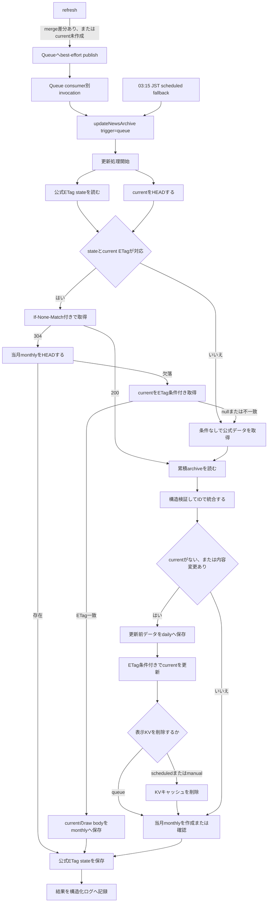

# お知らせアーカイブ更新仕様

## この文書の責務

本書は、`updateNewsArchive`を実行するQueue consumerとscheduled handlerの共通仕様を定義する。Queue consumerはrefreshが検出したmerge差分またはcurrent未作成を契機に別invocationで実行し、scheduled handlerはQueueが届かない場合にも更新を実行できる03:15 JSTのfallbackである。どちらも公式データを検証して累積archiveの正しさを確定し、必要なbackup、公式ETag state、公式確認時刻stateを保存する。

`GET /`はStatic AssetsからSSG済みshellを返し、`GET /api/kf3-news`はmerged結果用KV、GET専用snapshot KV、またはR2 snapshotを返す。GETのR2投影結果はGET専用KVへbest-effortで書き戻す。`POST /api/kf3-news/refresh`は表示用KVと公式確認時刻stateを更新し、merge差分がある場合またはcurrentが未作成の場合に`kf3-notif-archive-update` Queueへbest-effortで通知するが、archive、backup、公式ETag stateを変更しない。refresh、Queue consumer、scheduled handlerは別invocationとして扱う。refresh本体はリクエスト内で完了させ、Queue送信だけは`waitUntil`へ登録してレスポンス経路から分離する。共通の保存形式、R2とKVの役割、公式ETag stateの契約は [お知らせ機能共通仕様](./news-spec.md)、表示APIは [お知らせページリクエスト仕様](./news-page-request-spec.md) を参照する。

## 実行時刻と更新対象

リポジトリ上のCron設定は`15 18 * * *`で、毎日18:15 UTC、JSTでは翌日03:15に実行する。scheduled handlerは`controller.scheduledTime`を`updateNewsArchive`の`nowMs`へ渡し、backupの日付と実行時刻の基準にする。Queue consumerはconsumer invocation開始時の`Date.now()`を`nowMs`へ渡す。Queue consumerの実行時刻は、refreshが送信したmessageの`detectedAt`では決めない。本番Cronの登録状況と受け入れ確認は [お知らせアーカイブ導入状態](./news-archive-rollout.md) を参照する。

Queue consumerまたはscheduled handlerが更新または削除できる対象は次のとおりである。

- `KF3_NOTIF_DATA/archive/current.json`
- `KF3_NOTIF_DATA/archive/official-fetch-state.json`
- `KF3_NOTIF_DATA/archive/official-check-state.json`
- `KF3_NOTIF_BACKUP/daily/...`
- `KF3_NOTIF_BACKUP/monthly/...`
- current更新成功後のGET専用snapshot KV `kf3-news-archive-snapshot`の削除。scheduledまたはmanual更新ではWorkers KV `kf3-news`も削除し、Queue consumerは表示KVを維持する

refreshは公式確認時刻stateを更新し、表示用KVとrefresh制御metadataも更新する。merge差分がある場合またはcurrentが未作成の場合はQueueへ更新messageを送るが、Queue送信はbest-effortであり、`waitUntil`へ登録してレスポンス経路から分離する。送信失敗でもrefreshの200応答と表示用KVの保存を維持する。公式データの取得または検証が失敗した場合、Queue consumerまたはscheduled handlerはarchive、backup、公式ETag state、KVを変更せず失敗する。

## refreshからQueueへの委譲

refreshは公式データとcurrentまたはlegacyをmergeし、表示用配列をKVへ保存した後、merge差分がある場合またはcurrentが未作成の場合にQueueへ更新messageをpublishする。Queue送信は`waitUntil`へ登録し、refreshのレスポンスを待たせない。

- Queue名は`kf3-notif-archive-update`とする。
- message versionは`2`とし、`reason`、`detectedAt`、`addedCount`、`updatedCount`、`requiresInitialization`を含める。
- merge差分では`reason=refresh-detected-change`、current未作成では`reason=refresh-current-missing`と`requiresInitialization=true`を使用する。current未作成messageは追加・変更件数が0でも有効とする。
- Queue送信はbest-effortで行い、`waitUntil`へ登録する。送信失敗は`news_archive_update_enqueue_failed`へ記録するが、refreshの表示用KV保存を取り消さず、HTTP 200を返す。
- KV finalization前にrefresh leaseの残り時間が20秒未満の場合だけ、同じtokenのleaseをCASで5分間へ延長する。延長できない場合はKVへ書き込まず202を返す。
- KV保存後にcurrent ETagを確認し、競合時は保存したKVを削除して503を返す。currentが一致した場合は取得時または延長後のlease handleの期限を検証し、leaseTokenはcontrol metadataとして扱い、保持したcontrol ETagだけでcompletionをCASする。CAS不成立または期限切れの場合は他refreshのKVを削除せず202を返し、Queueへ通知しない。
- Queue consumerはmessageを検証し、別invocationで同じ`updateNewsArchive`を`trigger=queue`として実行する。`requiresInitialization=true`の場合も公式データを再取得し、currentがなければ既存の初回作成経路を使用する。
- Queue consumerが成功したmessageはackし、更新処理が失敗したmessageはackせず60秒後にretryする。
- scheduled handlerはQueue送信またはconsumer実行に依存せず、毎日03:15 JSTに`trigger=scheduled`で同じ更新処理を実行する。

## 処理フロー

## 更新処理（scheduledとqueueの共通処理）

`trigger=scheduled`と`trigger=queue`は同じ`updateNewsArchive`を実行する。

1. 公式ETag stateと`archive/current.json`のR2 ETagを並行して確認する。公式ETagとR2 ETagを比較するのではなく、stateに保存したcurrent ETagと現在のcurrent ETagが一致する場合だけ、stateの公式ETagを`If-None-Match`へ使用する。
2. 条件付き取得を使えない場合は、`archive/current.json`を読み、存在しない場合だけlegacyデータを読む。archive読み込みと公式取得は並行して行う。
3. 条件付き取得が200の場合は公式本文を検証した後にcurrentを読み、条件なし取得と同じ統合処理を行う。304の場合は公式本文とcurrent本文の解析、検証、統合、ソート、シリアライズ、daily保存、current更新、KV削除を省略する。
4. 304では当月monthlyを`head()`する。存在すればarchive本体と表示用KVを変更せず、公式確認時刻をstateへ保存して正常終了する。欠落していればcurrentをstateのETagで条件付き取得し、取得objectのETagが一致した場合だけraw bodyをJSON解析せずmonthlyへ保存する。条件不一致なら条件なしの完全処理へ戻る。
5. 200経路ではarchiveと公式データの基本構造、必須フィールドの型、ID一意性を検証し、IDをキーに統合する。公式データの新規または変更項目だけURLと日時を厳密に検証する。同じIDには公式データを採用し、archiveにだけ存在するIDは残す。
6. 未知フィールドを含むJSON値のdeep equalityで既存項目と公式項目を比較し、追加件数または変更件数から内容変更の有無を判定する。オブジェクトのキー順だけの違いは変更扱いにしない。
7. 内容変更がある場合だけ、統合結果を`newsDate`の降順、同時刻の場合は`id`の降順で決定的にソートし、JSONを1回だけシリアライズする。オブジェクトのキーは再帰的に並べ替えず、SHA-256 digestも計算しない。
8. 内容変更がある場合、更新前のarchiveの元のバイト列を`If-None-Match: *`の条件付きPUTで日次backupへ新規作成する。
9. 読み込み時のETagを条件に`archive/current.json`を更新する。初回作成時は、currentが存在しないことを条件にする。
10. current更新成功後はGET専用snapshot KVを削除する。`invalidateDisplayCache`が有効なscheduledまたはmanual更新ではKVの`kf3-news`も削除し、Queue consumerはrefresh由来のmerged KVを維持する。
11. 当月の月次backupを条件付きで新規作成する。すでに存在する場合は内容を再取得しない。条件不一致の場合は既存として扱い、本文を取得しない。
12. 200経路ではmonthly完了後に、公式strong ETag、確定済みcurrentのR2 raw ETag、公式確認時刻をETag stateへCAS保存する。304経路でもmonthly確認後に公式確認時刻をETag stateへCAS保存する。200/304の両経路で公式確認時刻を独立したofficial-check-stateへCAS保存する。state保存の失敗・競合でarchiveを巻き戻さず、結果のstatusへ反映して処理結果を構造化ログへ記録する。

currentがまだなく、legacyデータから移行する初回実行では、統合結果がlegacyと同じでも更新ありとして扱う。これにより、更新前legacyの日次backupと`archive/current.json`を作成する。

内容変更がない場合はソート、JSONシリアライズ、日次backup、current更新を省略し、表示KVも変更しない。ただし、当月の月次backupが欠けていれば、読み込み済みcurrentのバイト列から作成を試みる。

## 304経路

公式条件付きGETが304の場合、公式データとcurrentが前回の検証済み状態から変わっていないと判断する。次の処理を省略する。

- 公式レスポンス本文の読み込みとUTF-8デコード
- 公式JSONの解析と検証
- `archive/current.json`本文の読み込み、JSON解析、検証
- 累積archiveと公式データのID統合とdeep equality比較
- 統合結果のソートとJSONシリアライズ
- 日次backup、current更新、KV削除

月次backupの補完のため、当月の`monthly/YYYY-MM.json`を`head()`する。存在する場合も、archive本体と表示用KVを変更せず、公式確認時刻stateを更新して正常終了する。存在しない場合は次の順で作成する。

1. stateの`currentEtag`を条件に`archive/current.json`を取得する。
2. 条件不一致の場合は月次backupを作成せず、公式データを条件なしで再取得して完全処理へ切り替える。
3. current本文の`ReadableStream`をJSON解析せず、当月monthlyへ条件付きで新規作成する。
4. monthly keyが競合した場合は保存済みとして扱う。

## backup仕様

### 日次backup

- keyは`daily/YYYY/MM/DD/<UTC日時>.json`とする。
- `<UTC日時>`は`YYYY-MM-DDTHH-mm-ssZ`形式とし、ミリ秒を省略して時刻区切りのコロンをハイフンへ置き換える。例は`2026-08-01T18-15-00Z`とする。
- ディレクトリの日付はJST、ファイル名の日時はUTCとする。
- currentを変更する直前のarchiveの元のバイト列を保存する。
- 内容変更がある場合、またはcurrentを初回作成する場合だけ作成する。
- `If-None-Match: *`で既存objectの上書きを防ぐ。同じkeyがすでにある場合は重複実行または競合として失敗し、既存objectを読み直さない。

### 月次backup

- keyは`monthly/YYYY-MM.json`とし、年月はJSTで判定する。
- 各月で最初に正常に到達した実行が、本番反映済みのarchiveを保存する。
- 200または条件なしのfull経路では、先に当月monthlyを`head()`し、存在すればPUTせず保存済みとして扱う。欠落時だけ`If-None-Match: *`の条件付きPUTを実行する。
- 304経路では先に当月monthlyを`head()`し、存在すればPUTしない。欠落時だけcurrentをstateのETagで条件付き取得し、ETag一致時のraw bodyをmonthlyへ保存する。条件付き取得が`null`または不一致ならfull経路へ戻る。
- 条件付きPUTが`R2Object`を返した場合は新規作成、条件不一致で`null`を返した場合は保存済みとして扱う。別実行との競合で既存monthlyへのPUTがR2のBucket Lockエラー`10069`になった場合も保存済みとして扱い、既存本文は取得しない。
- currentの内容変更がない実行でも、月次backupが欠けていれば作成する。

日次および月次backupの内容は、復元dry-runまたは運用上の完全性監査で厳密に検証する。

運用上、`daily/`は90日後に削除するLifecycle Ruleを設定し、`daily/`と`monthly/`には30日間のBucket Lockを設定する。`monthly/`には期限削除を設定せず長期保持する。

## 公式データ検証のアーカイブ更新への適用

公式データの取得と統合には、[お知らせ機能共通仕様](./news-spec.md) の公式データ利用時の安全性検証を適用する。200経路では、検証済みの既存IDで初期化したMapへ公式項目を追加または置換する。このアルゴリズムにより、統合後の件数が更新前より減らず、更新前のすべてのIDが残ることを保証し、統合後の全件再走査は行わない。

Queue consumerまたはscheduled handlerで公式取得または検証に失敗した場合は、current、backup、公式ETag state、KVを変更せず処理全体を失敗させる。閾値を変更する場合は、実際の公式データが仕様変更されたことを確認し、定数とテストを同時に更新する。

## 同時実行と失敗時の扱い

- current更新には、読み込み時に取得したR2 ETagを使用する。
- currentが未作成の場合は、`If-None-Match: *`でobjectが存在しないことを条件に作成する。
- 条件付き更新が競合した場合は失敗とし、無条件上書きや自動再試行は行わない。
- 日次backupの保存に失敗した場合は、currentとKVを変更しない。
- current更新が競合した場合は、表示KVの処理と月次backupへ進まない。先に作成済みの日次backupは残す。
- current更新後のGET専用snapshot KV削除、またはscheduled/manualでのmerged KV削除に失敗した場合、current更新は巻き戻さず、月次backupの作成へも進まない。実行中のarchive更新は失敗として終了する。月次backupが欠けている場合は、次回の正常実行で作成を再試行する。
- 月次backupが`head()`で存在した場合は、保存済みとして扱い、PUTと本文取得を行わない。
- 月次backupの条件付きPUTが`null`を返した場合、または別実行との競合でBucket Lockエラー`10069`になった場合は、保存済みとして扱う。
- 月次backupの確認または保存で、それ以外の例外が発生した場合は失敗とし、current更新は巻き戻さない。次回の正常実行で月次backup作成を再試行する。

公式取得または検証が失敗した場合は、current、backup、公式ETag state、KVを変更しない。state保存が失敗または競合した場合だけは、確定済みcurrentを巻き戻さず、次回の完全処理へ委ねる。

## Queue consumerの実行契約

Queue consumerは次の設定と動作で運用する。

- `kf3-notif-archive-update`のbatch sizeは1、concurrencyは1とする。1 invocationで複数messageを並列処理しない。
- consumer開始時の`Date.now()`を`updateNewsArchive`の`nowMs`へ渡し、`trigger=queue`で実行する。
- 更新成功時はmessageをackする。message形式が不正な場合も更新を行わずackし、`news_archive_queue_invalid_message`へ記録する。
- `updateNewsArchive`が失敗した場合はackせず、60秒後にretryする。Wrangler設定の最大retry回数は3とする。
- Queue consumerはheartbeatを送信しない。`HEALTHCHECKS_PING_URL`はscheduled handlerの開始、成功、失敗通知に使用する。
- Queue consumerは`invalidateDisplayCache=false`で実行し、refreshが保存した表示KVをexpirationTtl満了まで維持する。クライアントは`officialCheckedAt`が5分以上古い表示を受け取るとrefreshを試みるため、表示用KVの保持時間と公式確認の更新間隔は別に管理する。
- 同じmessageが重複配送されても、既存のETag条件付き取得、R2 CAS、304経路で同じ更新結果を安全に再確認できる。無条件上書きは行わず、競合時はQueueのretryへ委ねる。

## 監視とログ

`HEALTHCHECKS_PING_URL`が設定されている場合、scheduled handlerは次のheartbeatを送る。

| タイミング | 送信先             |
| ---------- | ------------------ |
| 更新開始前 | `<ping URL>/start` |
| 更新成功後 | `<ping URL>`       |
| 更新失敗後 | `<ping URL>/fail`  |

heartbeatはHTTP POSTで送信する。ping URLの末尾の`/`は取り除いてからsuffixを付け、2xx以外のレスポンスも送信失敗として扱う。heartbeatは10秒でタイムアウトする。heartbeat自体の失敗はarchive更新を中断せず、秘密値を含まない`news_archive_heartbeat_failed`ログを残す。scheduledのarchive更新が失敗した場合はfail送信を試みた後、元のエラーを再送出してscheduled invocationも失敗させる。Queue consumerはheartbeatを送らず、Queueの成功またはretryを構造化ログへ記録する。

主な構造化ログイベントは次のとおり。

| イベント                             | 意味                                                           |
| ------------------------------------ | -------------------------------------------------------------- |
| `news_archive_update`                | scheduledまたはqueueの更新が完了した                           |
| `news_archive_update_failed`         | scheduledまたはqueueの更新がいずれかで失敗した                 |
| `news_archive_update_queued`         | refreshがQueueへ更新messageを送信した                          |
| `news_archive_update_enqueue_failed` | refreshのQueue送信に失敗した                                   |
| `news_archive_queue_succeeded`       | Queue messageの更新処理とackが完了した                         |
| `news_archive_queue_failed`          | Queue messageの更新処理に失敗しretryした                       |
| `news_archive_queue_invalid_message` | 不正なQueue messageを更新せずackした                           |
| `news_archive_heartbeat_failed`      | scheduledのheartbeat送信に失敗した                             |
| `news_api_error`                     | GETがレスポンスを構築できなかった                              |
| `news_api_succeeded`                 | GETが成功し、経路とcritical pathの処理時間を記録した           |
| `news_api_cache_write_failed`        | GETのwrite-throughまたは競合確認に失敗したがHTTP 200を維持した |
| `news_api_cache_cleanup_failed`      | GETの競合後snapshot削除に失敗した                              |
| `news_refresh_failed`                | refreshの依存処理または検証に失敗した                          |
| `news_refresh_cache_cleanup_failed`  | current競合後の表示用KV削除に失敗した                          |
| `news_refresh_succeeded`             | refreshが表示用KVを更新した                                    |

GETのKV missはarchive snapshotを投影してwrite-throughするが、公式取得失敗によるfallbackログを記録しない。GET成功時は`news_api_succeeded`へ`dataSource`（`merged-kv`、`snapshot-kv`、`r2`）、`primaryCacheReadDurationMs`、`snapshotCacheReadDurationMs`、`archiveReadDurationMs`、`officialCheckStateReadDurationMs`、`totalDurationMs`、`workerVersionId`を記録する。write-throughだけに失敗した場合は`news_api_cache_write_failed`を記録してHTTP 200を維持する。refreshの公式取得失敗、leaseまたはcooldownによる拒否は`news_refresh_failed`として記録し、scheduledまたはqueueのarchive更新失敗と区別する。Queue送信失敗は`news_archive_update_enqueue_failed`として記録するが、refresh成功を失敗へ変換しない。refresh成功は`news_refresh_succeeded`として記録する。

更新成功ログには更新有無、実行時刻、各件数、公式レスポンスのバイト数、backup key、`officialFetchStatus`、`conditionalRequestUsed`、`currentEtagMatchedState`、`officialBodyProcessed`、`monthlyBackupStatus`、`etagStateStatus`、処理時間を含める。公式ETagとR2 ETagの値自体はログへ出さない。処理時間は外部I/O待ちを含む経過時間であり、WorkersのCPU時間判定には使用しない。

refresh成功ログには`workerVersionId`、archive件数、merge後件数、追加件数、変更件数、current初期化の要否、archive更新の要否、Queue送信状態、lease完了状態、`officialFetchCount`、`officialFetchStatus`、`refreshDataSource`、`refreshEligibilityDurationMs`、`officialFetchDurationMs`、`refreshCacheReadDurationMs`、`archiveReadDurationMs`、`cachePutDurationMs`、`currentEtagCheckDurationMs`、`leaseCompletionDurationMs`を含める。各durationは外部I/O待ちを含む経過時間であり、制御metadataの内容、ETag値、公式本文、secretは記録しない。

失敗ログには処理段階とエラー詳細を含め、refreshの失敗ログには`workerVersionId`も含めるが、公式レスポンス本文やheartbeat URL、ETag値、refresh制御metadataの秘密値は含めない。汎用エラーの詳細には`originalError`としてnameとmessageだけを含める。制御文字と改行を空白へ正規化し、URL、Authorization、Bearer、一般的なtoken・secret・password形式、JWTと既知のtoken prefixをredactした後、nameを100文字、messageを500文字までに制限する。stack、cause、独自プロパティは含めず、非`Error`値は任意に文字列化せず固定値で記録する。

## 公式データの閾値と障害調査

閾値の正式な値と検証内容は、[お知らせ機能共通仕様の公式データ利用時の安全性検証](./news-spec.md#公式データ利用時の安全性検証) を参照する。この節では、scheduled、queue、またはrefreshで閾値超過や公式取得失敗が発生したときの調査方法を定義する。

scheduledまたはqueueの更新、またはrefreshに失敗した場合は、Workers Logsでそれぞれ`news_archive_update_failed`または`news_refresh_failed`を確認し、次の項目を順に見る。Queue送信失敗は`news_archive_update_enqueue_failed`、Queue retryは`news_archive_queue_failed`を確認する。

- `stage`
- `error`
- `details`
- `details.dataDetails.thresholdName`
- `details.dataDetails.configuredValue`
- `details.dataDetails.actualValue`

`NewsDataError`由来の閾値情報は`details.dataDetails`に入る。公式レスポンスの本文サイズ超過では、`details.contentLength`、`details.actualBytes`、`details.maxBytes`を確認する。

| 事象                                   | 確認する内容                                               |
| -------------------------------------- | ---------------------------------------------------------- |
| 公式データの件数不足                   | `stage`、`thresholdName`、`configuredValue`、`actualValue` |
| 既存IDの変更件数超過                   | `stage`、`thresholdName`、`configuredValue`、`actualValue` |
| `Content-Length`または実本文サイズ超過 | `stage`、`contentLength`、`actualBytes`、`maxBytes`        |
| 取得タイムアウト                       | `stage`、`error`、公式取得タイムアウト設定                 |
| JSON解析または構造検証失敗             | `stage`、`error`、`details`                                |
| refreshのlease競合またはcooldown       | `event`、`retryAfterSeconds`、拒否理由                     |

Healthchecks.ioはCron失敗やCron欠落の通知に使用し、Workers Logsはscheduled、queue、refreshの原因調査に使用する。Queue consumerにはheartbeatを設定しない。公式本文、`HEALTHCHECKS_PING_URL`、ETag値、制御metadataの秘密情報はログに記録しない。

## 304とETag stateの保存順序

公式ETag stateは、scheduledまたはqueueの`updateNewsArchive`で次の処理がすべて完了した後に保存する。

1. 公式レスポンスの取得と検証
2. 既存archiveとの統合
3. 内容変更がある場合の日次backupとcurrent更新
4. 表示KV invalidationが有効な場合のKV削除
5. 当月monthlyの作成または存在確認

統合結果に変更がない場合も、公式レスポンスのETag、読み込み済みcurrentのETag、公式確認時刻をstateへ保存する。公式のキー順や未知フィールド表現だけが変わり、統合結果が同一だった場合も、次回から新しいETagで条件付き取得できるようにする。304の場合も、公式レスポンスが正常に確認できた時刻でstateの`checkedAt`を更新する。

state PUTには、読み込み時のstate object ETagを使用する。stateが未作成の場合は存在しないことを条件にする。競合または保存失敗はarchiveの正しさへ影響しないため、archiveを巻き戻さず、成功ログの`etagStateStatus`へ反映して次回の完全処理へ委ねる。refreshは条件付き取得の判定にstateを読み取れるが、refresh成功後に公式ETag stateを更新してはならない。Queue consumerとscheduled fallbackは、同じETag/CAS/304の境界を共有するため、重複messageや近接実行でも無条件上書きを行わない。

stateをcurrent更新より先に保存してはならない。先に保存すると、currentへ反映されなかった公式ETagに対して翌日の取得が304となり、未反映の変更を省略する可能性がある。

ETag条件付き取得の共通設計は [お知らせアーカイブETag条件付き取得の実装仕様](./news-archive-etag-optimization.md) を参照する。
