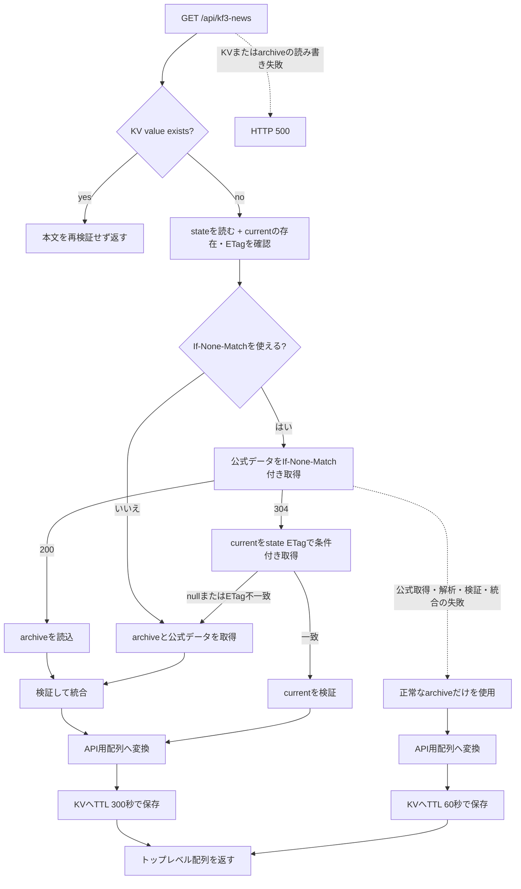

# ニュースページリクエスト仕様

## この文書の責務

本書は、ユーザーのページ表示に伴う`GET /api/kf3-news`の仕様を定義する。APIは定期実行が確定した累積アーカイブを入力として、公式データと統合したクライアント用一覧を返す。

この処理は表示用の結果キャッシュ以外の永続データを更新しない。`archive/current.json`、daily、monthly、公式ETag stateは定期実行だけが更新する。定期実行の仕様は [ニュースアーカイブ定期実行更新仕様](./news-archive-scheduled-spec.md)、保存形式と共通契約は [ニュース機能共通仕様](./news-spec.md) を参照する。

## APIレスポンス

`GET /api/kf3-news`は、過去に保存したお知らせと現在の公式お知らせを統合した一覧を返す。APIレスポンス形式はトップレベルのJSON配列とする。

```json
[
  {
    "targetUrl": "/info/detail/1234567890.html",
    "title": "お知らせのタイトル",
    "newsDate": "2026年08月02日 12時00分00秒",
    "updated": "",
    "category": "お知らせ"
  }
]
```

レスポンスには`targetUrl`、`title`、`newsDate`、`updated`を必須フィールドとして含め、保存用データに`category`がある場合だけ任意フィールドとして含める。`id`やその他の未知フィールドはクライアントへ返さない。

`category`がない、空文字、空白だけの場合、UIは分類ラベルを表示しない。`category`はカンマで分割し、値ごとに異なる背景色のラベルとして表示する。`【サイト】アプリ`は`アプリ`として表示し、`【サイト】`は表示しない。

APIは入力順を維持して返す。日付順への並べ替えは画面側で行う。キャッシュmetadataは次のレスポンスヘッダーへ投影する。

- `X-KF3-News-Source`
- `X-KF3-News-Fetched-At`

## 処理フロー



## cache hit

1. KVの`kf3-news`を`getWithMetadata`で読み込む。
2. キャッシュが存在すれば、Worker自身が保存した値として本文を再解析せずに返す。
3. R2や公式サーバーへアクセスしない。
4. KV metadataがあればレスポンスヘッダーへ変換する。metadataがない旧形式のKV valueや不正なmetadataでも、ニュース配列を壊さず`source`不明、取得日時不明として返す。

旧形式のcache hitから、公式データ取得の失敗や`archive-fallback`を推測してはならない。

## cache miss

### 条件付き取得を使えるかの確認

KVに値がない場合は、公式ETag stateと`archive/current.json`のR2 ETagを並行して確認する。次の条件を満たす場合だけ、stateの公式strong ETagを公式データの`If-None-Match`へ指定する。

1. `archive/current.json`が存在する。
2. stateがJSONとして解析でき、保存形式を満たす。
3. stateの`currentEtag`が現在のcurrent R2 ETagと一致する。
4. stateの`officialEtag`が利用可能なstrong ETagである。

公式ETagとR2 ETagを相互比較しない。stateが欠落・不正、currentがない、またはstateのcurrent ETagと現在のcurrent ETagが一致しない場合は、条件なしの公式GETへ戻る。APIはstateを更新しない。

### 304経路

公式データへの条件付きGETが304の場合は、公式本文を読み込まない。代わりに`archive/current.json`を、stateに保存されたcurrent ETagを条件に取得する。

- currentの条件付き取得がETag一致で成功した場合、本文を保存用スキーマで検証する。
- 検証済みcurrentをクライアント用配列へ投影し、通常結果としてKVへTTL 300秒で保存する。
- 公式本文の再取得、公式JSONの解析、累積アーカイブとの統合は行わない。
- currentの条件付き取得が`null`、ETag不一致、または取得エラーになった場合、古い本文を返さず、公式データの条件なしGETと通常の統合へ戻る。

304は公式取得エラーではない。公式とcurrentが前回の検証済み状態から変わっていないことを利用する正常経路である。

### 200または条件なし経路

条件付きGETが200の場合、または条件付き取得を使えない場合は、公式データと累積アーカイブを読み込んで統合する。[ニュース機能共通仕様](./news-spec.md) の公式データ利用時の安全性検証を適用し、検証に失敗した公式データは採用しない。

1. `archive/current.json`を読み、保存用スキーマを検証する。currentがない場合だけlegacyデータを読む。
2. 公式レスポンスを取得し、HTTPステータス、本文サイズ、JSON構造、必須フィールド、ID一意性を検証する。
3. 公式データの新規または変更項目を検証し、IDをキーに累積アーカイブへ統合する。同じIDには公式データを採用し、アーカイブにだけ存在するIDは残す。
4. 統合結果をクライアント用配列へ投影する。
5. 結果をKVの`kf3-news`へ保存して返す。

APIでの統合は入力順を維持し、R2の累積アーカイブやバックアップを更新しない。

## 公式データを利用できない場合

公式データの取得、解析、検証、統合のいずれかに失敗した場合、正常な累積アーカイブがあればそれだけをクライアント用配列へ投影して返す。

- `source`は`archive-fallback`とする。
- `fetchedAt`はcache miss時に結果を確定してKVへ保存する直前のISO 8601日時とする。
- fallbackのKV有効期間は60秒とする。
- HTTP 200を返し、画面上に保存済みアーカイブを表示していることを明示する。
- 公式データを利用できなくても、currentの更新、バックアップ作成、公式ETag stateの保存は行わない。

累積アーカイブ自体を読み込めない場合は、公式データだけでは応答しない。KVの読み込みまたは結果の保存、currentの読み込みに失敗した場合もHTTP 500とする。

```json
{
  "error": "ニュースデータの取得に失敗しました"
}
```

これらの失敗は`news_api_error`として記録する。fallbackへ切り替えた場合は`news_api_fallback`を記録する。

## KVキャッシュ

通常の統合結果は、次のmetadataとともに同じKV keyへ保存する。

```json
{
  "version": 1,
  "source": "merged",
  "fetchedAt": "2026-08-09T12:34:56.789Z"
}
```

`source`は通常の統合結果では`merged`、公式データを利用できず累積アーカイブだけを返す場合は`archive-fallback`とする。KV valueは従来のニュース配列JSONを維持する。

KVの読み込みまたは結果の保存に失敗した場合は、キャッシュを使わない応答へ切り替えずHTTP 500とする。KV valueの完全性は書き込み元で保証し、cache hit時には再検証しない。

## 互換route

互換性維持のため、`GET /entries_merged_20241107.json`と`HEAD /entries_merged_20241107.json`も残す。このrouteはR2オブジェクトを保存用スキーマで検証せず、そのバイト列をそのまま返す。レスポンスには1年間のimmutable cache指定と、取得できた場合はR2のHTTP ETagを付ける。

legacyオブジェクトが存在しない場合、またはR2から取得できない場合は5xxとする。`archive/current.json`は公開しない。

## この処理が行わないこと

ユーザーのページリクエストでは、次の操作を行わない。

- `archive/current.json`の更新
- dailyまたはmonthlyの作成、更新、削除
- 公式ETag stateの保存、更新、削除
- KVの`kf3-news`の削除
- 条件付きcurrent取得に失敗した古い本文の返却

ETag stateと304経路の共通設計は [ニュースアーカイブETag条件付き取得の実装仕様](./news-archive-etag-optimization.md) を参照する。
